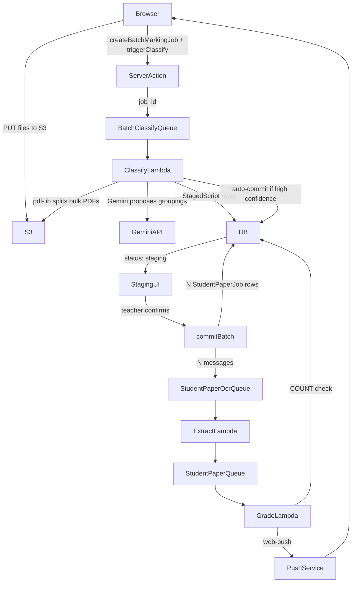

# Batch Marking Pipeline

## Architecture overview




## Step 1 — DB Schema (`packages/db/prisma/schema.prisma`)

### New enums

```prisma
enum BatchStatus {
  uploading
  classifying
  staging
  marking
  complete
  failed
}

enum ReviewMode {
  auto
  required
}

enum StagedScriptStatus {
  proposed
  confirmed
  excluded
}
```

### New models

```prisma
model BatchMarkingJob {
  id                   String      @id @default(cuid())
  exam_paper_id        String
  uploaded_by          String
  status               BatchStatus @default(uploading)
  review_mode          ReviewMode  @default(auto)
  total_student_jobs   Int         @default(0)
  notification_sent_at DateTime?
  error                String?
  job_events           Json?
  created_at           DateTime    @default(now())
  processed_at         DateTime?

  uploader       User              @relation("BatchMarkingJobUploader", fields: [uploaded_by], references: [id])
  exam_paper     ExamPaper         @relation(fields: [exam_paper_id], references: [id])
  student_jobs   StudentPaperJob[] @relation("BatchStudentJobs")
  staged_scripts StagedScript[]

  @@map("batch_marking_jobs")
}

model StagedScript {
  id             String             @id @default(cuid())
  batch_job_id   String
  // [{ s3_key, order, mime_type, source_file }]
  page_keys      Json
  proposed_name  String?
  confidence     Float?
  confirmed_name String?
  status         StagedScriptStatus @default(proposed)
  created_at     DateTime           @default(now())
  student_job_id String?

  batch_job   BatchMarkingJob  @relation(fields: [batch_job_id], references: [id])
  student_job StudentPaperJob? @relation("StagedScriptJob", fields: [student_job_id], references: [id])

  @@map("staged_scripts")
}

model UserPushSubscription {
  id         String   @id @default(cuid())
  user_id    String
  endpoint   String   @unique
  p256dh     String
  auth       String
  user_agent String?
  created_at DateTime @default(now())

  user User @relation("UserPushSubscriptions", fields: [user_id], references: [id])

  @@index([user_id])
  @@map("user_push_subscriptions")
}
```

### Existing model additions

`StudentPaperJob`: add

```prisma
  batch_job_id  String?
  remark_count  Int       @default(0)
  remarked_at   DateTime?

  batch_job     BatchMarkingJob? @relation("BatchStudentJobs", fields: [batch_job_id], references: [id])
  staged_script StagedScript?    @relation("StagedScriptJob")
```

`User`: add

```prisma
  batch_marking_jobs   BatchMarkingJob[]          @relation("BatchMarkingJobUploader")
  push_subscriptions   UserPushSubscription[]     @relation("UserPushSubscriptions")
```

`ExamPaper`: add

```prisma
  batch_marking_jobs BatchMarkingJob[]
```

### After schema changes — run in order

```bash
bun run db:generate
bun run db:push
bun run build
```

---

## Step 2 — Infra (`infra/queues.ts`)

Add one new queue and subscriber:

```ts
export const batchClassifyQueue = new sst.aws.Queue("BatchClassifyQueue", {
  visibilityTimeout: "5 minutes",
})

batchClassifyQueue.subscribe({
  handler: "packages/backend/src/processors/batch-classify.handler",
  link: [neonPostgres, geminiApiKey, scansBucket],
  timeout: "4 minutes",
  memory: "512 MB",
})
```

Also add `batchClassifyQueue` to the `studentPaperOcrQueue.subscribe` link array (the classify Lambda triggers OCR on commit) and add `VapidPublicKey` + `VapidPrivateKey` secrets:

```ts
export const vapidPublicKey = new sst.Secret("VapidPublicKey")
export const vapidPrivateKey = new sst.Secret("VapidPrivateKey")
```

Link both into `studentPaperQueue` subscriber (grade Lambda needs them to send push).

---

## Step 3 — New Lambda: `packages/backend/src/processors/batch-classify.ts`

Handles `{ batch_job_id }` from `BatchClassifyQueue`.

Logic:

1. Load `BatchMarkingJob` and its uploaded source file keys from the DB
2. For each source file:
  - If small PDF (≤5 pages) or image: treat as single student, `confidence: 1.0`
  - If large PDF: use `pdf-lib` to split into per-page PDFs stored at `batches/{batchId}/pages/page-{n}.pdf`; call Gemini with all pages to propose groupings and candidate names
3. Create `StagedScript` rows for each proposed student
4. Update `BatchMarkingJob.status = 'staging'`
5. If `review_mode === 'auto'` and all confidences `>= 0.90`: call the internal `commitBatch` logic immediately, set status `marking`

Key dependency: add `pdf-lib` to `packages/backend`.

---

## Step 4 — Push notification utility: `packages/backend/src/lib/push-notification.ts`

```ts
import webPush from 'web-push'
// loads VAPID keys from Resource, loads UserPushSubscription rows,
// calls webPush.sendNotification for each, uses Promise.allSettled
export async function sendBatchCompleteNotification(batchJobId, uploadedBy, examPaperTitle, studentCount)
```

Add `web-push` to `packages/backend` dependencies.

---

## Step 5 — Modify `packages/backend/src/processors/student-paper-grade.ts`

At the end of `completeGradingJob`, after the DB update, add:

```ts
const updatedJob = await db.studentPaperJob.findUnique({
  where: { id: jobId },
  select: { batch_job_id: true }
})
if (updatedJob?.batch_job_id) {
  await checkAndNotifyBatchCompletion(updatedJob.batch_job_id)
}
```

New `checkAndNotifyBatchCompletion` function uses the atomic `UPDATE ... WHERE total = COUNT(*) RETURNING` SQL pattern described in design. On match: calls `sendBatchCompleteNotification`, sets `notification_sent_at`.

Terminal statuses in COUNT: `('ocr_complete', 'failed', 'cancelled')` (matching existing `ScanStatus` values that grade Lambda sets).

---

## Step 6 — New server actions: `apps/web/src/lib/batch-actions.ts`

```ts
createBatchMarkingJob(examPaperId, reviewMode)   // creates BatchMarkingJob, returns { batchJobId, uploadUrls }
addFileToBatch(batchJobId, filename, mimeType)   // presigned PUT URL for S3 at batches/{id}/source/{filename}
triggerClassification(batchJobId)                // sends { batch_job_id } to BatchClassifyQueue
getBatchMarkingJob(batchJobId)                   // returns batch + staged_scripts for polling
updateStagedScript(id, { confirmedName, status }) // teacher edits
commitBatch(batchJobId)                          // creates N StudentPaperJob rows, triggers OCR for each, sets total_student_jobs
registerPushSubscription({ endpoint, p256dh, auth, userAgent }) // upserts UserPushSubscription
```

The `commitBatch` action:

1. Loads all `confirmed` StagedScripts for the batch in a Prisma transaction
2. Creates `N` `StudentPaperJob` rows with `batch_job_id` set and `pages` from `StagedScript.page_keys`
3. Sets `BatchMarkingJob.total_student_jobs = N`, `status = 'marking'`
4. After transaction: sends N messages to `StudentPaperOcrQueue`

---

## Step 7 — Service worker: `apps/web/public/sw.js`

Static file — handles `push` event (shows OS notification) and `notificationclick` event (opens the batch results URL passed in the push payload).

---

## Step 8 — Push subscription registration

In `apps/web/src/app/teacher/layout.tsx`, add a client component that:

1. On mount, registers the service worker from `/sw.js`
2. Requests notification permission once (with user gesture or silently if already granted)
3. Gets `PushSubscription` from the browser
4. Calls `registerPushSubscription` server action to upsert it

Expose `NEXT_PUBLIC_VAPID_PUBLIC_KEY` env var (from `sst.Secret`) for the browser subscription call.

---

## Step 9 — `BatchMarkingDialog`: the five-phase dialog

**File:** `apps/web/src/app/teacher/exam-papers/[id]/batch-marking-dialog.tsx`

Follows the exact pattern of `[marking-job-dialog.tsx](apps/web/src/app/teacher/exam-papers/[id]/marking-job-dialog.tsx)` — a single `Dialog` component with internal phase state. The dialog size expands at the staging phase.

```ts
type Phase = 'upload' | 'classifying' | 'staging' | 'marking' | 'done'
```

### Phase 1 — Upload (`max-w-lg`)

Mirrors `[upload-student-script-dialog.tsx](apps/web/src/app/teacher/exam-papers/[id]/upload-student-script-dialog.tsx)` but:

- Accepts any number of files (PDFs and images, no client-side conversion)
- Uploads raw to `batches/{batchId}/source/` via `addFileToBatch` server action
- When all files are uploaded: calls `triggerClassification`, advances to `classifying`

### Phase 2 — Classifying (`max-w-lg`)

`Spinner` + "Analysing your upload…" description. Polls `getBatchMarkingJob` every 3s. Auto-advances when `status === 'staging'`. Shows cancel button.

### Phase 3 — Staging review (`sm:max-w-4xl`, taller content)

Grid of `Card` components, one per `StagedScript`:

- Thumbnail strip of page images (small presigned S3 `img` tags, same pattern as `scan-document-viewer.tsx` thumbnail strip)
- Editable student name (`Input`, `onBlur` calls `updateStagedScript`)
- Confidence `Badge` (green ≥0.9, amber 0.7–0.9, red <0.7 — same `scoreColor` logic as `grading-result-card.tsx`)
- Exclude toggle (`Button` variant="outline")
- "View pages" opens a `Sheet` slide-over with `ScanDocumentViewer` for that student's pages

CTA row at dialog footer: "Start marking N scripts" calls `commitBatch`, advances to `marking`.

### Phase 4 — Marking in progress (`max-w-lg`)

`Progress` bar showing `complete/total`. Polls every 3s. "View results" link to `/teacher/mark/papers/[examPaperId]`. User can close dialog — batch continues; the Submissions tab pulsing dot is the persistent signal.

### Phase 5 — Done (`max-w-lg`)

Summary card: N scripts marked, average score. Two CTAs: "View all results →" (navigates to stats page) and "Close".

---

## Step 10 — FAB evolution + Submissions tab batch states

### FAB split in `[exam-paper-page-shell.tsx](apps/web/src/app/teacher/exam-papers/[id]/exam-paper-page-shell.tsx)`

The existing single `<button>` at line 1096 becomes a split button group:

```tsx
<div className="fixed bottom-6 right-6 z-50 flex items-center rounded-full shadow-lg">
  {/* Left: existing single-script flow unchanged */}
  <button onClick={() => setUploadScriptOpen(true)} className="...rounded-l-full...">
    <PenLine className="h-4 w-4" /> Mark paper
  </button>
  {/* Right: new batch flow */}
  <button onClick={() => setBatchOpen(true)} className="...rounded-r-full border-l...">
    <Users className="h-4 w-4" />
    <span className="sr-only">Upload class batch</span>
  </button>
</div>
```

`setBatchOpen` controls the new `BatchMarkingDialog`.

### Submissions tab batch-aware states

The `Submissions` tab trigger gains a pulsing dot when any `BatchMarkingJob` is in `marking` status:

```tsx
<TabsTrigger value="submissions" className={tabTriggerClass}>
  Submissions
  {hasActiveBatch && (
    <span className="ml-1.5 h-1.5 w-1.5 rounded-full bg-primary animate-pulse shrink-0" />
  )}
  {/* existing count badge unchanged */}
</TabsTrigger>
```

The `TabsContent` for `submissions` conditionally renders based on `BatchMarkingJob.status`:

```
if status = 'classifying' → spinner + "Analysing upload…"
if status = 'staging'     → StagedScript review cards + "Start marking" CTA
                            (same cards as BatchMarkingDialog Phase 3, re-used component)
if status = 'marking'     → "N of M scripts marked" progress card + existing SubmissionGrid below
default                   → existing SubmissionGrid unchanged
```

The staging review cards are extracted into a shared `StagedScriptReviewCards` component used by both the dialog (Phase 3) and the inline Submissions tab view.

---

## Step 11 — Rich stats page: `exam-paper-stats-shell.tsx`

**File:** `apps/web/src/app/teacher/mark/papers/[examPaperId]/exam-paper-stats-shell.tsx`

Replaces the current thin layout with a class marking dashboard:

**Header row:** Paper title + "Mark class" button (opens `BatchMarkingDialog` from this page too — needs `examPaperId` threaded through).

**KPI strip** (4 cards in a grid):

- Total marked
- Average score %
- Failed / needs re-mark count
- Active / in-progress count (with `Loader2` spin)

**Active batch progress card** (shown when any batch is in `marking`):

- `Progress` bar with `complete/total`
- "28 of 30 scripts marked · 2 in progress"

**Grade distribution chart** (when ≥3 completed submissions):

- `recharts` `BarChart` — already in `apps/web/package.json`
- X-axis: score bands (0–20%, 20–40%, 40–60%, 60–80%, 80–100%)
- Uses existing `grading_results` data already on each `StudentPaperJob`

**Per-question averages table** — already exists in the shell, kept as-is.

**Individual results table** — already exists. Each "View →" opens the existing `MarkingJobDialog` (full-screen, unchanged). Add a re-mark action button per row.

---

---

## Testing infrastructure

### How it works

Tests run against the real dev AWS environment using `sst shell`, which injects all `Resource.`* bindings into the process environment. Tests send messages to real SQS queues, Lambda processes them, and tests poll the DB for expected outcomes.

```bash
# Run all integration tests
npx sst shell -- vitest run tests/integration

# Run one suite during development
npx sst shell -- vitest run tests/integration/batch-classify.test.ts
```

Add to root `package.json` scripts:

```json
"test:integration": "sst shell -- vitest run tests/integration"
```

### Tooling setup

Add `vitest` to root `devDependencies`:

```bash
bun add -d vitest
```

Create `tests/vitest.config.ts`:

```ts
import { defineConfig } from 'vitest/config'

export default defineConfig({
  test: {
    // Each test file gets its own isolated DB records via unique IDs
    // Long timeout — Lambdas can take up to 3 minutes end-to-end
    testTimeout: 180_000,
    hookTimeout: 30_000,
    // Run test files sequentially to avoid SQS concurrency issues
    pool: 'forks',
    poolOptions: { forks: { singleFork: true } },
  },
})
```

### Test helpers (`tests/integration/helpers/`)

`**wait-for.ts**` — polls a predicate until it returns non-null or times out:

```ts
export async function waitFor<T>(
  fn: () => Promise<T | null | undefined>,
  { timeout = 120_000, interval = 3_000 } = {}
): Promise<T> {
  const deadline = Date.now() + timeout
  while (Date.now() < deadline) {
    const result = await fn()
    if (result != null) return result
    await new Promise(r => setTimeout(r, interval))
  }
  throw new Error(`waitFor timed out after ${timeout}ms`)
}
```

`**db.ts**` — shared Prisma client for test assertions:

```ts
import { createPrismaClient } from '@mcp-gcse/db'
import { Resource } from 'sst'
export const db = createPrismaClient(Resource.NeonPostgres.databaseUrl)
```

`**sqs.ts**` — send a message to a real queue:

```ts
import { SQSClient, SendMessageCommand } from '@aws-sdk/client-sqs'
const sqs = new SQSClient({})
export const sendToQueue = (queueUrl: string, body: object) =>
  sqs.send(new SendMessageCommand({ QueueUrl: queueUrl, MessageBody: JSON.stringify(body) }))
```

`**s3.ts**` — upload a test file and return its S3 key:

```ts
import { S3Client, PutObjectCommand } from '@aws-sdk/client-s3'
import { Resource } from 'sst'
const s3 = new S3Client({})
export const uploadTestFile = async (key: string, body: Buffer, contentType: string) => {
  await s3.send(new PutObjectCommand({ Bucket: Resource.ScansBucket.name, Key: key, Body: body, ContentType: contentType }))
  return key
}
```

`**fixtures.ts**` — creates and tears down test DB records:

```ts
export async function createTestBatch(examPaperId: string, userId: string) {
  return db.batchMarkingJob.create({ data: { exam_paper_id: examPaperId, uploaded_by: userId, status: 'uploading' } })
}
export async function cleanupBatch(batchId: string) {
  // delete in FK order: student jobs → staged scripts → batch
  await db.studentPaperJob.deleteMany({ where: { batch_job_id: batchId } })
  await db.stagedScript.deleteMany({ where: { batch_job_id: batchId } })
  await db.batchMarkingJob.delete({ where: { id: batchId } })
}
```

### Phase 0 — Exam paper fixture

The test suite needs exam paper `cmnajrwnx0000dxw36cojno51` (AQA Business "ABC", 2026, 35 marks, 12 questions) to exist in the target environment. It was extracted from the `stuartbourhill` branch of the DeepMark Neon project and must not be assumed to exist.

`**tests/fixtures/exam-paper-abc.json**` stores the full snapshot:

- A dedicated test user: `test-user-batch-pipeline` / `test+batch@deepmark.test` (role: teacher)
- The exam paper row
- 1 section (`cmnajs9oh000c9ww31znl5ufq`, "Section 1", 35 marks)
- 12 questions: Q1.1–Q1.4 (MCQ, 1 mark each), Q01.5–Q01.7, Q02.1–Q02.5 (written, 2–9 marks)
- 12 mark schemes covering all three marking methods: `deterministic` (MCQs), `point_based` (short answer), `level_of_response` (Q02.2 4 marks, Q02.3 6 marks, Q02.5 9 marks)
- 12 `exam_section_questions` join rows

Full data is populated from the DB export done during planning (project `snowy-bar-65699801` / branch `br-tiny-silence-abe1n0s9`). The file uses the dedicated test user as `created_by_id` throughout.

`**tests/integration/helpers/seed.ts**` — `ensureExamPaper()`:

- Upserts all fixture rows using `upsert` / `createMany skipDuplicates`
- Returns immediately if exam paper already exists (fast re-run)
- Called in `beforeAll` in every test file

### Real test files (already in repo at `y10_papers/`)


| File                  | Pages | Content                                                       | Test role                       |
| --------------------- | ----- | ------------------------------------------------------------- | ------------------------------- |
| `sofia-1.png`         | 1     | Page 1 of Sofia's AQA Business script (name visible top-left) | classify: single JPEG           |
| `sofia-2.png`         | 1     | Page 2 of Sofia's script                                      | classify: multi-image group     |
| `sofia-3.png`         | 1     | Page 3 of Sofia's script                                      | classify: multi-image group     |
| `sofia-1.pdf`         | 3     | All 3 Sofia pages in one PDF                                  | classify: single-student PDF    |
| `y10_scanpaper_3.pdf` | 4     | 2 complete student scripts (2 pages each)                     | classify: bulk PDF → 2 students |


Tests reference files with `path.resolve(process.cwd(), 'y10_papers', filename)` and upload to S3 via `uploadTestFile()` before sending to the queue.

---

### Test files and what they verify

#### `tests/integration/batch-classify.test.ts`

Written **after** `batch-classify.ts` Lambda is built.

```
it('classifies sofia-1.png (single JPEG) as 1 proposed StagedScript')
it('classifies sofia-1.pdf (3-page single-student PDF) as 1 proposed StagedScript')
it('classifies 3 separate Sofia PNGs uploaded together as 1 proposed StagedScript')
it('classifies y10_scanpaper_3.pdf (4-page bulk PDF) as 2 proposed StagedScripts')
it('auto-commits y10_scanpaper_3.pdf when all confidence >= 0.90 and review_mode = auto')
it('stays in staging when review_mode = required regardless of confidence')
```

Each test:

1. `beforeAll`: calls `ensureExamPaper()`
2. Creates a `BatchMarkingJob` via `createTestBatch(examPaperId, testUserId)`
3. Uploads fixture file(s) to `batches/{batchId}/source/` via `uploadTestFile()`
4. Sends `{ batch_job_id }` to `Resource.BatchClassifyQueue.url`
5. `waitFor` polls DB until `BatchMarkingJob.status` is `staging`, `marking`, or `failed`
6. Asserts on `StagedScript` count, `proposed_name` (should include "Sofia" for Sofia tests), `confidence`, `status`
7. `afterEach` calls `cleanupBatch(batchId)`

---

#### `tests/integration/commit-batch.test.ts`

Written **after** `batch-actions.ts` server actions are built.

```
it('creates 1 StudentPaperJob from 1 confirmed StagedScript (3 Sofia pages)')
it('creates 2 StudentPaperJobs from 2 confirmed StagedScripts (y10_scanpaper_3 students)')
it('sets total_student_jobs = N on BatchMarkingJob atomically')
it('each StudentPaperJob.pages matches the StagedScript.page_keys')
it('rejects commit if any StagedScript is still in proposed status')
```

Tests call `commitBatch(batchId)` directly as a service function (not the Next.js server action wrapper, to avoid auth middleware). StagedScripts are inserted manually with real S3 keys from `uploadTestFile()` calls — commit is tested without going through the classify Lambda.

---

#### `tests/integration/batch-grade-completion.test.ts`

Written **after** the grade Lambda changes are built. This is the most important test suite.

```
it('sets batch status to complete when COUNT of terminal jobs = total_student_jobs')
it('sets notification_sent_at exactly once')
it('does not complete when only some child jobs are terminal')
it('is idempotent: running the completion check twice does not double-notify')
```

Approach — these tests skip the full OCR/grade pipeline and manipulate DB state directly to trigger the completion check:

```ts
// Create batch with 2 jobs already created
const batch = await db.batchMarkingJob.create({ data: { ..., total_student_jobs: 2, status: 'marking' } })
const job1 = await db.studentPaperJob.create({ data: { ..., batch_job_id: batch.id, status: 'ocr_complete' } })
const job2 = await db.studentPaperJob.create({ data: { ..., batch_job_id: batch.id, status: 'ocr_complete' } })

// Call the internal checkAndNotifyBatchCompletion function directly (exported for testing)
await checkAndNotifyBatchCompletion(batch.id)

const updated = await db.batchMarkingJob.findUnique({ where: { id: batch.id } })
expect(updated.status).toBe('complete')
expect(updated.notification_sent_at).not.toBeNull()

// Run again — idempotency check
await checkAndNotifyBatchCompletion(batch.id)
const updated2 = await db.batchMarkingJob.findUnique({ where: { id: batch.id } })
expect(updated2.notification_sent_at).toEqual(updated.notification_sent_at) // unchanged
```

The `checkAndNotifyBatchCompletion` function must be **exported** from `student-paper-grade.ts` to enable this. The push send is mocked via a vitest mock to avoid sending real push notifications in tests.

---

### What the test suite does NOT cover

- Full end-to-end OCR + grade via real SQS (too slow for CI, ~10 min per student) — this is manual smoke test territory
- Browser push notification delivery (requires a real browser with service worker)
- The staging UI (no browser automation in scope)

---

## Build order (with tests interleaved)

```
1.  Schema changes → db:generate → db:push → bun run build
2.  Add vitest to root devDependencies; create tests/vitest.config.ts + test:integration script
3.  Create tests/fixtures/exam-paper-abc.json (from Neon export) + tests/integration/helpers/
4.  Infra changes (BatchClassifyQueue + VAPID secrets)
5.  Backend: push-notification.ts utility
6.  Backend: modify student-paper-grade.ts (export checkAndNotifyBatchCompletion)
7.  ✅ Write + run: batch-grade-completion.test.ts
        npx sst shell -- vitest run tests/integration/batch-grade-completion.test.ts
8.  Backend: batch-classify.ts processor
9.  ✅ Write + run: batch-classify.test.ts  (uses sofia-1.png, sofia-1.pdf, y10_scanpaper_3.pdf)
        npx sst shell -- vitest run tests/integration/batch-classify.test.ts
10. Server actions: batch-actions.ts (commitBatch exported as service fn)
11. ✅ Write + run: commit-batch.test.ts  (uses sofia-1.pdf pages + y10_scanpaper_3.pdf students)
        npx sst shell -- vitest run tests/integration/commit-batch.test.ts
12. Frontend: public/sw.js
13. Frontend: push subscription in teacher/layout.tsx
14. Frontend: BatchMarkingDialog (5-phase dialog) + shared StagedScriptReviewCards component
15. Frontend: FAB split button in exam-paper-page-shell.tsx
16. Frontend: Submissions tab batch-aware states in exam-paper-page-shell.tsx
17. Frontend: Rich stats page (exam-paper-stats-shell.tsx)
```

Running tests at steps 7, 9, 11 gives you verified backend correctness before any frontend work starts. Each run uses real AWS resources (S3, SQS, Lambda, Neon) via `sst shell`, with real student handwriting that Gemini must correctly parse and classify.

### No new pages or routes needed for the batch UX

The batch upload → staging review → progress flow all lives inside `BatchMarkingDialog`. The only URL the teacher sees change is the stats page when they navigate to view results. No new Next.js routes are required for the batch workflow itself.
