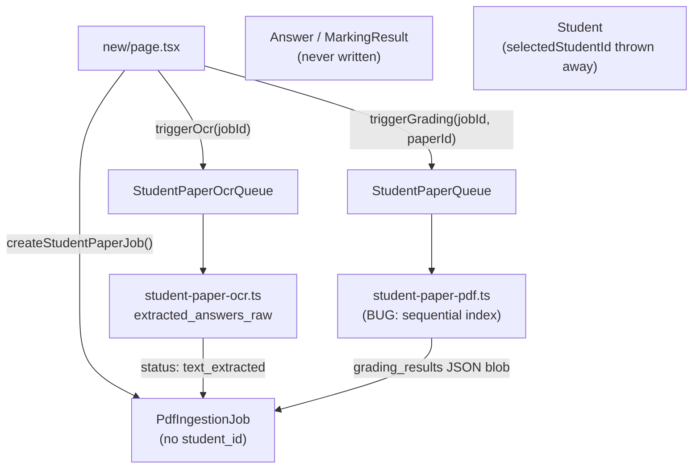

# Grading Pipeline Fixes — Phased Plan

## Architecture: current data flow




---

## Phase 1 — Fix the grading bug (1 file)

**Root cause:** `[packages/backend/src/processors/student-paper-pdf.ts](packages/backend/src/processors/student-paper-pdf.ts)` ignores `q.question_number` and uses a sequential integer counter instead. The OCR returns answers keyed to the real paper numbers (e.g. `"1a"`, `"2bii"`). Every lookup in the `answerMap` returns `undefined` → empty string → "no answer provided".

**Changes to `student-paper-pdf.ts`:**

1. Build `questionList` using `q.question_number ?? String(questionIndex)` instead of `String(questionIndex)`.
2. Normalise on both sides before inserting/looking up in `answerMap`:

```ts
function normaliseQNum(s: string): string {
  return s.replace(/^q/i, "").replace(/\s/g, "").toLowerCase()
}
```

1. Position-based fallback: after building the `answerMap`, if any question in `questionList` has no match and `questionList.length === extractedRaw.answers.length`, fall back to index-position matching (answer[0] → question[0], etc.).

---

## Phase 2 — Student linking + proper Answer/MarkingResult persistence

### 2a. Schema migration

Add to `PdfIngestionJob` in `[packages/db/prisma/schema.prisma](packages/db/prisma/schema.prisma)`:

```prisma
student_id  String?
student     Student? @relation("JobStudent", fields: [student_id], references: [id])
```

Add the back-relation on `Student`:

```prisma
pdf_ingestion_jobs PdfIngestionJob[] @relation("JobStudent")
```

Run `bun run db:migrate` in `packages/db`.

### 2b. New server action — link student to job

Add `linkStudentToJob(jobId, studentId)` to `[apps/web/src/lib/mark-actions.ts](apps/web/src/lib/mark-actions.ts)`. Verifies job ownership + student belongs to teacher, then writes `student_id`.

### 2c. Fix `handleConfirmStudent` in `new/page.tsx`

`[apps/web/src/app/teacher/mark/new/page.tsx](apps/web/src/app/teacher/mark/new/page.tsx)` currently throws `selectedStudentId` away. Fix:

- `studentMode === "select"`: call `linkStudentToJob(jobIdRef.current, selectedStudentId)`
- `studentMode === "create"`: call `createStudent(name)` then `linkStudentToJob(jobIdRef.current, newStudent.id)`

The `confirmStudentForSubmission` / `createAndConfirmStudent` imports from `student-actions.ts` can be removed from this file — they target `ScanSubmission` (old pipeline).

### 2d. Write Answer + MarkingResult rows after grading

In `student-paper-pdf.ts`, after the grading loop and before writing `status: "ocr_complete"`, if `job.student_id` is set:

- For each `qItem` with a result: `db.answer.create({ question_id, student_id, student_answer, source: "scanned", ... })`
- Then `db.markingResult.create({ answer_id, mark_scheme_id: ms.id, mark_points_results: grade.markPointsResults, total_score, llm_reasoning, ... })`

This also requires adding `mark_points_results` to the `GradingResult` type and capturing `grade.markPointsResults` in the grading loop (it's already returned by the orchestrator).

---

## Phase 3 — Dashboard UX

### 3a. Auto-refresh on `[jobId]/page.tsx`

Create a thin `"use client"` wrapper component `MarkingJobPoller` that polls `getStudentPaperJob` every 5 seconds when `status` is one of `["pending", "processing", "grading"]`, and refreshes the router when it transitions to `ocr_complete`, `text_extracted`, or `failed`. The server component renders this wrapper for in-progress states. Remove the "This page does not auto-refresh" message.

### 3b. Editable extracted answers

New server action `updateExtractedAnswer(jobId, questionNumber, newText)` in `mark-actions.ts`:

- Loads `extracted_answers_raw`, finds the entry by normalised `question_number`, replaces `answer_text`, writes back.

UI: add a pencil-edit inline control per answer in the extracted-answers accordion on the `[jobId]` dashboard (mirroring the existing `StudentNameEditor` pattern in `[results-client.tsx](apps/web/src/app/teacher/mark/%5BjobId%5D/results-client.tsx)`). After saving, show a "Re-mark" button if a paper is already selected.

### 3c. Re-OCR button

New server action `retriggerOcr(jobId)` in `mark-actions.ts`:

- Verifies ownership + `pages` is non-empty
- Clears `extracted_answers_raw`, `grading_results`, `student_name`, `detected_subject`
- Resets `status → "pending"`
- Sends to `Resource.StudentPaperOcrQueue.url`

Surface as a "Re-scan" button on the `[jobId]` page whenever the job has pages stored (i.e. `pages_count > 0`).

---

## File change summary

- `packages/backend/src/processors/student-paper-pdf.ts` — Phases 1 + 2d
- `packages/db/prisma/schema.prisma` — Phase 2a
- `apps/web/src/lib/mark-actions.ts` — Phases 2b + 3b + 3c
- `apps/web/src/app/teacher/mark/new/page.tsx` — Phase 2c
- `apps/web/src/app/teacher/mark/[jobId]/page.tsx` — Phase 3a
- `apps/web/src/app/teacher/mark/[jobId]/results-client.tsx` — Phase 3b

