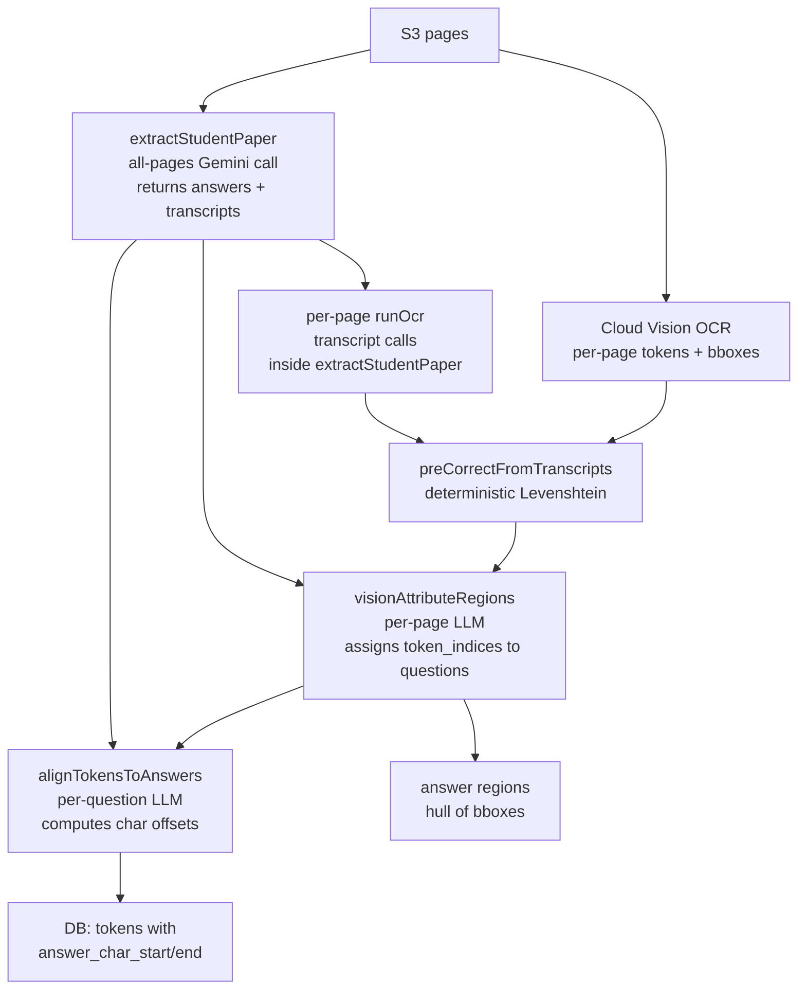
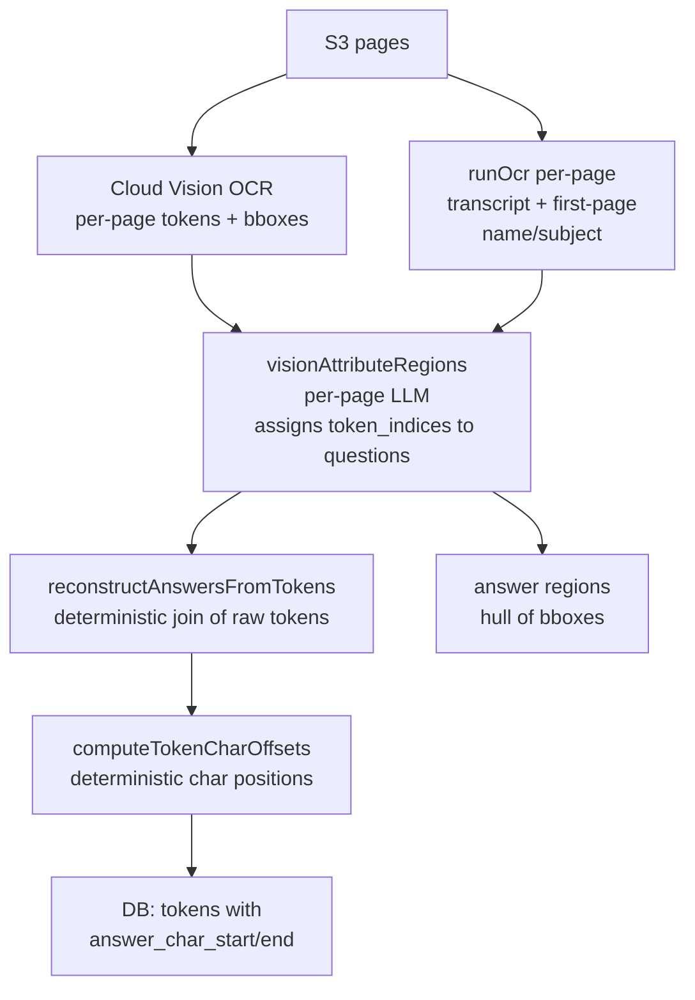

# OCR Extraction Pipeline Refactor

## Current Pipeline (4 LLM call categories)



## New Pipeline (2 LLM call categories)



**LLM calls eliminated:** `extractStudentPaper` (1 large all-pages call) + `alignTokensToAnswers` (N per-question calls).

**Intermediate steps removed:** `preCorrectFromTranscripts` — the Levenshtein pre-correction pass is dropped entirely. It was a heuristic bridge between two systems that no longer exist separately. Removing it shortens the trace path and makes token → answer a single deterministic step. If OCR noise proves to be a problem post-refactor, it will surface as a specific bad token on a specific question — a clean, fixable signal.

---

## Files to Modify

### 1. [`packages/backend/src/lib/scan-extraction/gemini-ocr.ts`](packages/backend/src/lib/scan-extraction/gemini-ocr.ts)

Extend `HandwritingAnalysis` and `TranscriptSchema` to optionally return `student_name` and `detected_subject`. Add a `RunOcrOptions.extractMetadata?: boolean` flag — only true for the first page.

```typescript
// New fields on HandwritingAnalysis (optional)
type HandwritingAnalysis = {
  transcript: string
  observations: string[]
  studentName?: string | null
  detectedSubject?: string | null
}
```

### 2. [`packages/backend/src/lib/scan-extraction/vision-attribute.ts`](packages/backend/src/lib/scan-extraction/vision-attribute.ts)

Three changes:
- Remove the `extractedAnswers` parameter from `VisionAttributeArgs` and `visionAttributeRegions`.
- Add a `pageTranscripts: Map<number, string>` parameter — keyed by page order, sourced from the `runOcr` results. Pass the relevant page transcript into `buildAttributionPrompt` as context for the LLM to match short/numeric answers.
- Replace the `CorrectedPageToken` import (from the now-deleted `vision-reconcile.ts`) with a locally defined `PageToken` type — just the raw fields without `text_corrected`.

### 3. [`packages/backend/src/lib/scan-extraction/vision-attribute-prompt.ts`](packages/backend/src/lib/scan-extraction/vision-attribute-prompt.ts)

Three changes:
- Remove `answerHint` from the question lines.
- **Switch token list format from line-per-token to compact JSON tuples** to reduce input token count. A 300-token page currently costs ~600 prompt tokens for the token list alone; the compact format cuts this by ~40-50%.
- Add the page transcript as a context section in the prompt, replacing the per-question answer hint.

Current token format (verbose):
```
0: "hello"
1: "world"
2: "benefit"
```

New token format (compact `[index, "word"]` tuples):
```
[0,"hello"],[1,"world"],[2,"benefit"]
```

Updated `buildAttributionPrompt` signature:
```typescript
export function buildAttributionPrompt(
  tokenList: string,
  questionsText: string,
  pageTranscript: string,  // new — full Gemini reading of the page
): string
```

The transcript appears in the prompt as: `"Page transcript (use to identify short/numeric answers): <transcript>"`. This gives the LLM the same anchor that `extractedAnswers` provided, but without the tight coupling to pre-extracted question-level text.

### 4. [`packages/backend/src/processors/student-paper-extract.ts`](packages/backend/src/processors/student-paper-extract.ts)

Main orchestration changes:
- Remove `extractStudentPaper` call; fan out Cloud Vision + `runOcr` per page in parallel directly.
- Pass `extractMetadata: true` for `sortedPages[0]` (first page) to get name/subject.
- Remove `preCorrectFromTranscripts` call and all `text_corrected` DB writes from this phase.
- Remove the `rawTokensForAttribution` workaround (the map that explicitly nulled `text_corrected` before passing to attribution — no longer needed).
- Build a `pageTranscripts: Map<number, string>` from the `runOcr` results and pass to `visionAttributeRegions`.
- After attribution, call `reconstructAnswersFromTokens` (joins `text_raw`) → answer text per question.
- Replace `alignTokensToAnswers` + `persistTokenOffsets` with `computeTokenCharOffsets` + same chunked DB update.
- Remove `buildQuestionGroups` helper (only existed for `alignTokensToAnswers`).
- Store reconstructed answers in `ocrRun.extracted_answers_raw`.

---

## New Files to Create

### 5. `packages/backend/src/lib/scan-extraction/reconstruct-answers.ts`

Pure function — takes attributed tokens (with `question_id` set) and returns `{ question_id, answer_text }[]` by joining `text_raw` in reading order (`page_order → para_index → line_index → word_index`). No `text_corrected` fallback — raw token text is the only source.

```typescript
type AttributedToken = {
  question_id: string
  page_order: number
  para_index: number
  line_index: number
  word_index: number
  text_raw: string
}

export function reconstructAnswersFromTokens(
  tokens: AttributedToken[],
  questionIds: string[],
): Array<{ question_id: string; answer_text: string }>
```

### 6. `packages/backend/src/lib/scan-extraction/compute-token-offsets.ts`

Pure deterministic function — for each question, concatenates tokens in reading order, tracks cumulative char offsets, returns `TokenOffsetUpdate[]`. Reuses `splitWithOffsets` from `align-tokens-to-answer-core.ts` if useful, otherwise is a simple reduce.

```typescript
export function computeTokenCharOffsets(
  tokensByQuestion: Map<string, AttributedToken[]>,
): TokenOffsetUpdate[]
```

---

## Files to Delete

- `packages/backend/src/lib/scan-extraction/gemini-extract.ts` — replaced entirely
- `packages/backend/src/lib/scan-extraction/align-tokens-to-answer.ts` — LLM-based, replaced by deterministic
- `packages/backend/src/lib/scan-extraction/align-tokens-to-answer-prompt.ts` — no longer needed
- `packages/backend/src/lib/scan-extraction/transcript-pre-correct.ts` — pre-correction step removed entirely
- `packages/backend/src/lib/scan-extraction/vision-reconcile.ts` — dead code; `reconcilePageTokens` was never wired into the pipeline
- `packages/backend/src/lib/scan-extraction/vision-reconcile-prompt.ts` — dead code, paired with the above

**Keep:** `align-tokens-to-answer-core.ts` — `splitWithOffsets` may be reused in the new deterministic offset computation.

---

## LLM Call Site Registry

[`packages/shared/src/llm/types.ts`](packages/shared/src/llm/types.ts) — `LLM_CALL_SITE_DEFAULTS` array.

Two entries must be **removed**:
- `"student-paper-extraction"` (step 1, once) — the all-pages answer extraction call
- `"token-answer-mapping"` (step 4, per-question) — the LLM char offset mapping call

One entry must be **updated**:
- `"handwriting-ocr"` — update description to reflect that the first-page call also extracts student name and detected subject.

After the code change, an admin "Sync Defaults" press will remove the two obsolete `LlmCallSite` DB rows. Old submission snapshots that still reference these keys will gracefully degrade in `llm-snapshot-panel.tsx` (falls back to raw key as display name).

---

## Key Constraints

- **Reading order** for token joins: `page_order → para_index → line_index → word_index` (existing DB ordering, same as `buildQuestionGroups` today).
- **MCQ tokens**: attribution still assigns token indices for MCQs; reconstruction joins them to a single letter — this is correct.
- **Student name/subject**: sourced from `runOcr` first-page metadata call. If the first page has no name (unusual), both fields remain `null` — same behaviour as today.
- **`extracted_answers_raw`** field on `OcrRun` continues to store the per-question answer snapshot; now populated from reconstructed tokens rather than Gemini extraction. No schema change required.
- **`text_corrected` column**: the column still exists on `StudentPaperPageToken` in the DB schema — no migration needed. It will simply always be `null` for submissions run after this refactor. Do not remove it from the Prisma schema in this change.
- The MCQ fallback in `visionAttributeRegions` (`runMcqFallback`) still uses `extractedAnswers` internally. Since we're removing that parameter, the MCQ fallback should look at the image alone (already has `questionsText` with question numbers). Verify this doesn't regress MCQ detection.
