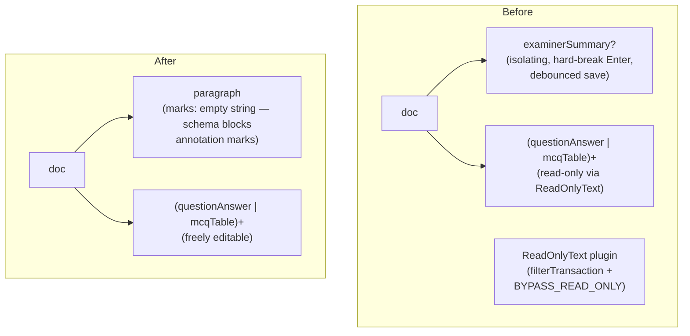

# Paragraph Node Refactor

## Architecture



**Document schema changes:**
- Before: `"examinerSummary? (questionAnswer | mcqTable)+"`
- After: `"(paragraph | questionAnswer | mcqTable)+"`

Paragraphs can appear anywhere — before, between, or after question blocks.

---

## Files to delete

- [`examiner-summary-node.ts`](apps/web/src/components/annotated-answer/examiner-summary-node.ts)
- [`examiner-summary-view.tsx`](apps/web/src/components/annotated-answer/examiner-summary-view.tsx)
- [`read-only-text.ts`](apps/web/src/components/annotated-answer/read-only-text.ts)

---

## Files to create

### `paragraph-node.ts` (new)
`apps/web/src/components/annotated-answer/paragraph-node.ts`

```ts
export const ParagraphNode = Node.create({
  name: "paragraph",
  group: "block",
  content: "inline*",
  marks: "",  // annotation marks blocked at schema level; expands to "bold italic" when those extensions land
  parseHTML() { return [{ tag: "p" }] },
  renderHTML() { return ["p", {}, 0] },
})
```

No NodeView — renders as a plain `<p>`. No special attrs needed.

---

## Files to modify

### [`annotated-answer-sheet.tsx`](apps/web/src/components/annotated-answer/annotated-answer-sheet.tsx)

1. Replace imports: remove `ExaminerSummaryNode`, `ReadOnlyText`, `BYPASS_READ_ONLY`; add `ParagraphNode`
2. Update Document content expression: `"(paragraph | questionAnswer | mcqTable)+"`
3. Remove `ReadOnlyText` from extensions array
4. Add `ParagraphNode` to extensions array
5. In the stage-sync `useEffect` (around line 261): remove `.setMeta(BYPASS_READ_ONLY, true)` — no filter to bypass any more. Keep `.setMeta("addToHistory", false)` and `.setMeta("preventUpdate", true)`

### [`build-doc.ts`](apps/web/src/components/annotated-answer/build-doc.ts)

1. Remove `examinerSummary?: string | null` and `jobId?: string | null` parameters; replace with `examinerSummary?: string | null` only (jobId no longer needed)
2. Replace the `examinerSummary` block push with a `paragraph` block:
```ts
if (examinerSummary) {
  blocks.push({
    type: "paragraph",
    content: [{ type: "text", text: examinerSummary }],
  })
}
```

### [`grading-results-panel.tsx`](apps/web/src/app/teacher/mark/papers/[examPaperId]/submissions/[jobId]/results/grading-results-panel.tsx)

Remove `jobId` from the `buildAnnotatedDoc` call (5th argument now, no 6th):
```ts
buildAnnotatedDoc(
  data.grading_results,
  marksByQuestion,
  alignmentByQuestion,
  tokensByQuestion,
  data.examiner_summary,  // seeds the leading paragraph; no jobId
)
```
Update the `useMemo` dependency array to match.

### [`apply-annotation-mark.ts`](apps/web/src/components/annotated-answer/apply-annotation-mark.ts)

Add a command-level guard at the top of `applyAnnotationMark` — if the selection is not inside a `questionAnswer` node, return `null` immediately. Schema already enforces this, but the guard prevents the function doing unnecessary work and makes intent clear:

```ts
const $from = editor.state.doc.resolve(selFrom)
const inQuestionAnswer = Array.from(
  { length: $from.depth + 1 },
  (_, d) => $from.node(d).type.name,
).includes("questionAnswer")
if (!inQuestionAnswer) return null
```

Update the comment on line 68 that references `ReadOnlyText` (it no longer exists).

### [`annotation-toolbar.tsx`](apps/web/src/components/annotated-answer/annotation-toolbar.tsx)

Add a helper inside the component to check if the selection is within a `questionAnswer` node, and gate the `disabled` prop on annotation buttons with it. This prevents the toolbar appearing active/enabled when the teacher's cursor is inside a paragraph.

```ts
const inQuestionAnswer = useMemo(() => {
  const { from } = editor.state.selection
  const $from = editor.state.doc.resolve(from)
  for (let d = $from.depth; d >= 0; d--) {
    if ($from.node(d).type.name === "questionAnswer") return true
  }
  return false
}, [editor.state.selection, editor.state.doc])

// Then: disabled={!hasSelection || !inQuestionAnswer}
```

### [`types.ts`](apps/web/src/lib/marking/types.ts)

Remove `UpdateExaminerSummaryResult` type (dead code — nothing saves teacher notes yet).

### [`submissions/mutations.ts`](apps/web/src/lib/marking/submissions/mutations.ts)

Remove `updateExaminerSummary` server action and its `UpdateExaminerSummaryResult` import (dead code).

---

## What is NOT changed

- [`queries.ts`](apps/web/src/lib/marking/submissions/queries.ts) — still selects and returns `examiner_summary` from DB; needed to seed the leading paragraph block
- [`pdf-export/student-section.tsx`](apps/web/src/lib/marking/pdf-export/student-section.tsx) — reads `examiner_summary` directly from the DB payload, not from the PM doc; leave untouched
- `GradingRun.examiner_summary` DB field — unchanged; still written by the grader processor and read for seeding
- `questionAnswer` node — unchanged; freely editable now with no filter needed
- `BubbleMenu` in `annotated-answer-sheet.tsx` — annotation actions already call `applyAnnotationMark`, which now returns null early if not in a question answer; no separate guard needed there
