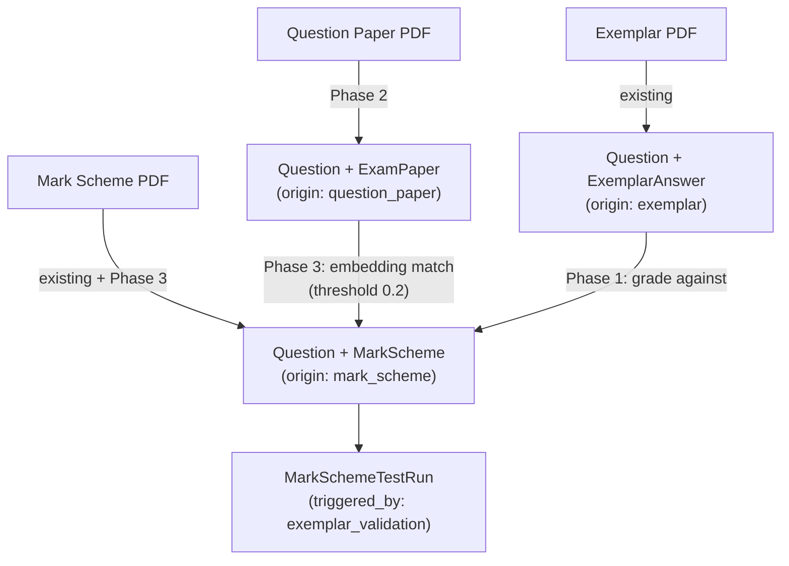

# PDF Upload Workflow — All Three Phases




---

## Phase 1 — Exemplar validation of mark schemes

**Goal:** Use uploaded real exemplar answers as ground-truth to test whether the grader agrees with examiners.

### Schema changes — `[packages/db/prisma/schema.prisma](packages/db/prisma/schema.prisma)`

- Add `exemplar_id String?` to `MarkSchemeTestRun` with optional relation to `ExemplarAnswer`
- No other schema changes needed; `MarkSchemeTestRun.triggered_by` already accepts any string

```prisma
model MarkSchemeTestRun {
  // existing fields...
  exemplar_id      String?
  exemplar         ExemplarAnswer? @relation(fields: [exemplar_id], references: [id])
}
```

Also add the back-relation on `ExemplarAnswer`:

```prisma
model ExemplarAnswer {
  // existing fields...
  test_runs  MarkSchemeTestRun[]
}

```

### New backend function — `packages/backend/src/services/validate-with-exemplars.ts`

- Accepts a `mark_scheme_id`
- Fetches all `ExemplarAnswer` records where `mark_scheme_id` matches OR where `question_id` matches the mark scheme's question and `expected_score` is not null
- For each exemplar, calls `grader.gradeSingleResponse()` (or `gradeSingleResponseLoR()` for level-of-response schemes)
- Stores results as `MarkSchemeTestRun` with `triggered_by: "exemplar_validation"` and `exemplar_id` set
- Returns a summary: total exemplars tested, pass count (within ±1 mark), accuracy percentage

### Auto-trigger in exemplar processor

In `[packages/backend/src/processors/exemplar-pdf.ts](packages/backend/src/processors/exemplar-pdf.ts)`, after all exemplars are created, call `validateWithExemplars` for each unique `mark_scheme_id` among the newly created exemplars that have one.

### UI — mark scheme detail / exemplar list view

- On the exemplars list page, show a "Validation" column: accuracy badge (e.g. "80% — 8/10") for exemplars linked to a mark scheme
- Ability to manually trigger re-validation

---

## Phase 2 — Question paper as a third PDF type

**Goal:** Teachers can upload the actual exam paper PDF, which creates Questions + ExamPaper without a mark scheme.

### Schema changes — `[packages/db/prisma/schema.prisma](packages/db/prisma/schema.prisma)`

```prisma
enum PdfDocumentType {
  mark_scheme
  exemplar
  question_paper   // new
}

enum QuestionOrigin {
  mark_scheme
  exemplar
  question_paper
  manual
}

model Question {
  // existing fields...
  origin  QuestionOrigin  @default(mark_scheme)
}
```

### New processor — `packages/backend/src/processors/question-paper-pdf.ts`

Gemini schema extracts:

```
{ questions: [{ question_text, question_type, total_marks, question_number }],
  exam_paper: { title, subject, exam_board, year, paper_number, total_marks, duration_minutes } }
```

Processing steps (same pattern as mark-scheme-pdf.ts):

1. Create `ExamPaper` from detected metadata
2. Create `ExamSection` (single section initially)
3. For each question: create `Question` with `origin: question_paper`, embed it, add to `ExamSectionQuestion`
4. No `MarkScheme` created

### Infrastructure — `[infra/queues.ts](infra/queues.ts)`

```ts
export const questionPaperQueue = new sst.aws.Queue("QuestionPaperQueue", {
  visibilityTimeout: "10 minutes",
})
// S3 trigger: filterPrefix: "pdfs/question-papers/"
questionPaperQueue.subscribe({ handler: "...question-paper-pdf.handler", ... })
```

### Upload form — `[apps/web/src/app/dashboard/upload/new/page.tsx](apps/web/src/app/dashboard/upload/new/page.tsx)`

- Add `question_paper` option to the document type selector
- Subject remains required for all types
- No "auto-create exam paper" checkbox for this type (it always creates one)
- Exam paper metadata amendment form reused (same flow as mark scheme)

### Server action — `[apps/web/src/lib/pdf-ingestion-actions.ts](apps/web/src/lib/pdf-ingestion-actions.ts)`

- S3 prefix: `pdfs/question-papers/<jobId>/document.pdf`
- Update `PdfDocumentType` type to include `"question_paper"`

---

## Phase 3 — Out-of-order reconciliation

**Goal:** When a mark scheme PDF arrives after a question paper PDF, it should match existing questions rather than creating duplicates.

### Schema changes

```prisma
enum MarkSchemeStatus {
  linked           // question_id is set and confirmed
  auto_linked      // set by embedding match, awaiting review
  unlinked         // no question found, needs manual assignment
}

model MarkScheme {
  // existing fields...
  link_status  MarkSchemeStatus  @default(linked)
}
```

### Mark scheme processor changes — `[packages/backend/src/processors/mark-scheme-pdf.ts](packages/backend/src/processors/mark-scheme-pdf.ts)`

- Relax vector similarity threshold: `0.1 → 0.2` (line 183 in current file)
- When a match is found via embedding: set `link_status: auto_linked`
- When no match: create new question as now, set `link_status: linked` (it's the canonical source)
- `Question.origin` set to `mark_scheme` on creation, unchanged on update

### UI changes

- On the Questions list page: show `origin` badge (Question Paper / Mark Scheme / Exemplar)
- On a future mark scheme detail page: show `link_status` — "Auto-linked (review)" with a button to confirm or reassign
- Dashboard stat: count of `MarkScheme` records with `link_status: unlinked` or `auto_linked`

---

## Execution order within each phase

Each phase is independently deployable. Phase 2 (question paper type) can be done before or after Phase 1 (exemplar validation). Phase 3 depends on Phase 2 existing to be meaningful.

Recommended order: **Phase 1 → Phase 2 → Phase 3**.
