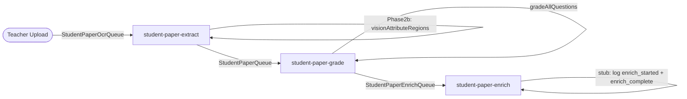

# Pipeline Refactor + Enrich Lambda Scaffold

## New pipeline shape




## Files changed

### 1. `packages/db/src/events.ts`

- Add missing `token_reconciliation_complete` variant (already emitted by `vision-reconcile.ts` but absent from the union):
`{ type: "token_reconciliation_complete"; at: string; tokens_corrected: number }`
- Add two new event variants for the enrich stage:
`{ type: "enrich_started"; at: string }`
`{ type: "enrich_complete"; at: string }`
- Widen the `job_failed` phase union: `"ocr" | "grading" | "enrich"`

### 2. `packages/backend/src/lib/sqs-job-runner.ts`

- Add `"enrich"` to the `phase` parameter union in `markJobFailed` (mirrors the `events.ts` change)

### 3. `packages/backend/src/processors/student-paper-extract.ts`

Add **Phase 2** after the existing fan-out and token DB insert, still inside the per-record `try` block, before queuing grade:

```typescript
// Phase 2a — correct raw Vision tokens against the page image
await reconcilePageTokens({ pages: sortedPages, jobId })

// Phase 2b — assign corrected tokens to questions, derive answer regions
const attributeQuestions: VisionAttributeQuestion[] = questionSeeds.map((s) => ({
  question_id: s.question_id,
  question_number: s.question_number,
  question_text: s.question_text,
  is_mcq: s.question_type === "multiple_choice",
}))
await visionAttributeRegions({
  questions: attributeQuestions,
  extractedAnswers: extraction.answers,
  pages: sortedPages,
  s3Bucket: bucket,
  jobId,
})
```

- Add imports: `reconcilePageTokens` from `@/lib/vision-reconcile`, `visionAttributeRegions` + `VisionAttributeQuestion` from `@/lib/vision-attribute`
- Move the `region_attribution_started` `logStudentPaperEvent` call to here (before Phase 2b), since it currently fires from grade

### 4. `packages/backend/src/processors/student-paper-grade.ts`

- Remove `beginVisionAttribution`, `beginTokenReconciliation` and their call sites
- Remove the four now-unused imports: `visionAttributeRegions`, `VisionAttributeQuestion`, `reconcilePageTokens`, `ReconcilePageEntry`
- In `completeGradingJob`: add SQS enqueue to the new enrich queue — mirrors the same pattern used at the end of `student-paper-extract.ts`:

```typescript
await sqs.send(new SendMessageCommand({
  QueueUrl: Resource.StudentPaperEnrichQueue.url,
  MessageBody: JSON.stringify({ job_id: jobId }),
}))
```

- Add module-level `const sqs = new SQSClient({})`, and the `SQSClient` / `SendMessageCommand` / `Resource` imports

### 5. `packages/backend/src/processors/student-paper-enrich.ts` *(new file)*

Stub handler modelled on `student-paper-grade.ts`:

- Parse `job_id` via `parseSqsJobId`
- Log `enrich_started` event
- Log `enrich_complete` event
- Return `{}` (no `batchItemFailures`)
- Uses `markJobFailed` with `phase: "enrich"` in the catch block

### 6. `infra/queues.ts`

- Add queue definition:

```typescript
export const studentPaperEnrichQueue = new sst.aws.Queue("StudentPaperEnrichQueue", {
  visibilityTimeout: "10 minutes",
})
```

- Subscribe the stub:

```typescript
studentPaperEnrichQueue.subscribe({
  handler: "packages/backend/src/processors/student-paper-enrich.handler",
  link: [neonPostgres, geminiApiKey, scansBucket],
  timeout: "10 minutes",
  memory: "1 GB",
})
```

- Add `studentPaperEnrichQueue` to the grade lambda's `link` array
- Bump extract lambda `timeout` from `"8 minutes"` to `"10 minutes"` (Phase 2 adds ~30s for a typical script)
- Update the `studentPaperOcrQueue` comment to reflect Phase 2 now runs inside extract

### 7. `infra/web.ts` *(optional, low-priority)*

- Add `studentPaperEnrichQueue` to the Next.js `link` array for future direct triggering from server actions

## Ordering / sequencing notes

- Phase 2a (`reconcile`) must fully complete before Phase 2b (`attribution`) starts — this is enforced by sequential `await`, not `Promise.all`. Internally each function fans out across all pages in parallel.
- Both are now **awaited** in extract, eliminating the fire-and-forget Lambda freeze risk and the race condition where attribution read uncorrected tokens.
- The grade lambda becomes a pure assessment unit: no vision calls, no spatial work.

