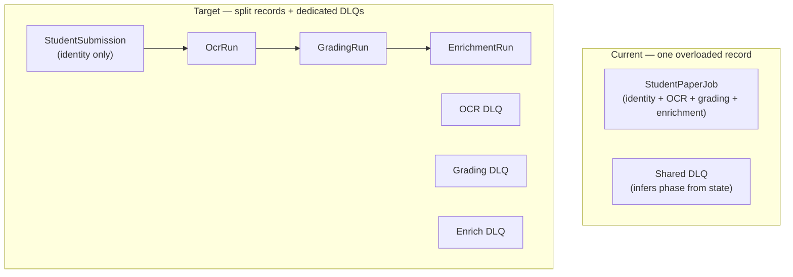

# DeepMark Pipeline Refactor — 4-Phase Build Plan

## Architecture overview



---

## Phase 1 — Split shared DLQ (infra only, no DB changes)

**Goal:** Each queue gets its own DLQ handler that already knows its phase. Eliminates all state-inference logic from [`student-paper-dlq.ts`](packages/backend/src/processors/student-paper-dlq.ts).

### Changes

**[`infra/queues.ts`](infra/queues.ts)**
- Replace single `studentPaperDlq` with three dedicated queues: `studentPaperOcrDlq`, `studentPaperGradingDlq`, `studentPaperEnrichDlq`
- Wire each source queue to its own DLQ (`dlq: { queue: ..., retry: 2 }`)
- Subscribe each DLQ to its own handler (30s timeout, `link: [neonPostgres]`)

**New files**
- `packages/backend/src/processors/student-paper-ocr-dlq.ts` — calls `markJobFailed(jobId, TAG, "ocr", ...)`. No state inspection needed.
- `packages/backend/src/processors/student-paper-grading-dlq.ts` — calls `markJobFailed(jobId, TAG, "grading", ...)`.
- `packages/backend/src/processors/student-paper-enrich-dlq.ts` — sets `enrichment_status: "failed"` **only** (does NOT call `markJobFailed`; never touches main job status); logs `job_failed` event with `phase: "enrich"`.

**Delete:** `packages/backend/src/processors/student-paper-dlq.ts`

**Build:** `bun run build`

---

## Phase 2 — Schema evolution (additive, no data migration needed)

**Goal:** Proper enum for enrichment status; remove dead ScanStatus values; wire `grading` status; persist `marking_method` on GradingResult; replace unsound `as ScanStatus` casts.

### 2a — Prisma schema

[`packages/db/prisma/schema.prisma`](packages/db/prisma/schema.prisma)

- Add `EnrichmentStatus` enum: `pending | processing | complete | failed`
- Change `enrichment_status String?` → `enrichment_status EnrichmentStatus?`
- Remove dead `ScanStatus` values: `extracting`, `extracted`, `graded` (verify no DB rows hold these values before pushing)

### 2b — Wire `grading` ScanStatus

[`packages/backend/src/processors/student-paper-grade.ts`](packages/backend/src/processors/student-paper-grade.ts)
- `markJobAsProcessing` → set `status: ScanStatus.grading` instead of `"processing"`

[`apps/web/src/app/teacher/mark/[jobId]/shared/phase.ts`](apps/web/src/app/teacher/mark/[jobId]/shared/phase.ts)
- `derivePhase` already has `"grading"` in the `marking_in_progress` condition — no change needed

[`apps/web/src/app/teacher/mark/[jobId]/phases/scan-processing.tsx`](apps/web/src/app/teacher/mark/[jobId]/phases/scan-processing.tsx)
- `STATUS_LABELS` already has `grading` — no change needed

[`apps/web/src/app/teacher/mark/papers/[examPaperId]/stats-config.ts`](apps/web/src/app/teacher/mark/papers/[examPaperId]/stats-config.ts)
- `statusLabel` already handles `grading` — no change needed

### 2c — Replace `as ScanStatus` with `satisfies ScanStatus`

All backend processors that do `"processing" as ScanStatus` etc. — replace with the enum object value (`ScanStatus.processing`) or `satisfies`. Affected files (from research):
- `student-paper-extract.ts`, `student-paper-grade.ts`, `exemplar-pdf.ts`, `question-paper-pdf.ts`, `mark-scheme-pdf.ts`, `sqs-job-runner.ts`, `student-paper-ocr-dlq.ts`, `student-paper-grading-dlq.ts`, `student-paper-enrich-dlq.ts`

Requires changing `import type { ScanStatus }` → `import { ScanStatus }` where the value is used.

### 2d — Persist `marking_method` on GradingResult

[`packages/backend/src/lib/grade-questions.ts`](packages/backend/src/lib/grade-questions.ts)
- Add `marking_method: "deterministic" | "point_based" | "level_of_response"` to the `GradingResult` type
- Populate it in `gradeOneQuestion` from `question.markingMethod` (available in `buildQuestionWithScheme`)

[`apps/web/src/lib/marking/types.ts`](apps/web/src/lib/marking/types.ts)
- Add `marking_method: "deterministic" | "point_based" | "level_of_response"` to the frontend `GradingResult` type

Removing dead `stats-config.ts` cases (`extracting`, `extracted`) is part of this phase.

**Build:** `bun db:generate && bun db:push && bun run build`

---

## Phase 3 — Full model split

**Goal:** `StudentPaperJob` becomes four domain models. Each run owns its own status, error, and events. Re-marks and re-scans produce new run rows with natural history.

### 3a — New Prisma models

[`packages/db/prisma/schema.prisma`](packages/db/prisma/schema.prisma)

New enums:
```
enum OcrStatus     { pending processing complete failed cancelled }
enum GradingStatus { pending processing complete failed cancelled }
// EnrichmentStatus already added in Phase 2
```

New models (required fields are required — no optional for backwards compat):

- **`StudentSubmission`** — identity: `s3_key`, `s3_bucket`, `uploaded_by`, `exam_board`, `exam_paper_id`, `pages` (required Json). Carries `batch_job_id`, `staged_script_id`, `student_name`, `student_id`, `detected_subject`, `superseded_at` (can be removed — replaced by `OcrRun.is_current`). Relations: `word_tokens`, `answer_regions`, `ocr_runs`, `grading_runs`.
- **`OcrRun`** — `submission_id` (required), `status: OcrStatus`, `error?`, `extracted_answers_raw?`, `page_analyses?`, `vision_raw_s3_key?`, `job_events?`, `is_current: Boolean`, timestamps. Relation: `grading_runs[]`.
- **`GradingRun`** — `submission_id` (required), `ocr_run_id` (required — which scan was graded from), `status: GradingStatus`, `error?`, `grading_results?`, `job_events?`, `is_current: Boolean`, timestamps. Relation: `enrichment_run?`.
- **`EnrichmentRun`** — `grading_run_id` (required, `@unique`), `status: EnrichmentStatus`, `error?`, timestamps. Relation: `annotations[]`.

Move relations: `StudentPaperAnswerRegion.job_id` → `ocr_run_id`; `StudentPaperAnnotation.job_id` → `enrichment_run_id`; `StudentPaperPageToken.job_id` → `ocr_run_id`.

`remark_count`, `remarked_at`, `superseded_at` are dropped — derived from run counts/timestamps.

### 3b — Data migration

Prisma migration SQL: for each existing `StudentPaperJob` row, insert corresponding rows into `StudentSubmission`, `OcrRun`, `GradingRun`, `EnrichmentRun` based on current status. Mark all migrated runs as `is_current: true`.

### 3c — Backend processors

- [`student-paper-extract.ts`](packages/backend/src/processors/student-paper-extract.ts) — create/update `OcrRun` instead of `StudentPaperJob`
- [`student-paper-grade.ts`](packages/backend/src/processors/student-paper-grade.ts) — create/update `GradingRun`; `markJobAsProcessing` → `markGradingRunProcessing`
- [`student-paper-enrich/handler.ts`](packages/backend/src/processors/student-paper-enrich/handler.ts) — create/update `EnrichmentRun`
- [`sqs-job-runner.ts`](packages/backend/src/lib/sqs-job-runner.ts) — `markJobFailed` becomes `markOcrRunFailed` / `markGradingRunFailed` (or a generic `markRunFailed(table, id, ...)`)
- Phase 1 DLQ handlers — update to target the correct run table

### 3d — Web queries and mutations

[`apps/web/src/lib/marking/queries.ts`](apps/web/src/lib/marking/queries.ts) — rewrite `getStudentPaperJob` to join `StudentSubmission` → latest `OcrRun` → latest `GradingRun` → `EnrichmentRun`. Keep the same `StudentPaperJobPayload` shape for the initial pass (minimise frontend component changes).

[`apps/web/src/lib/marking/mutations.ts`](apps/web/src/lib/marking/mutations.ts) — `triggerGrading`, `retriggerGrading`, `retriggerOcr`, `triggerEnrichment` — all target run tables.

`JobTimeline` — merge `job_events` across `OcrRun` + `GradingRun` + `EnrichmentRun` for the unified timeline display.

**Build:** `bun db:generate && bun db:push && bun run build`

---

## Phase 4 — Frontend annotation UX fixes

**Goal:** Fix the broken `hasAnnotations` signal, gate annotation controls on LoR questions, add deterministic point-based and MCQ annotations in the enrichment handler.

### 4a — Fix `hasAnnotations` (independent of Phase 2)

[`apps/web/src/app/teacher/mark/papers/[examPaperId]/submissions/[jobId]/submission-view.tsx`](apps/web/src/app/teacher/mark/papers/[examPaperId]/submissions/[jobId]/submission-view.tsx)
- `annotations` array is already fetched here. Pass `annotationCount={annotations.length}` to `SubmissionToolbar`.

[`apps/web/src/app/teacher/mark/papers/[examPaperId]/submissions/[jobId]/submission-toolbar.tsx`](apps/web/src/app/teacher/mark/papers/[examPaperId]/submissions/[jobId]/submission-toolbar.tsx)
- Accept `annotationCount: number` prop
- Change `hasAnnotations = data.enrichment_status === "complete"` → `hasAnnotations = data.enrichment_status === "complete" && annotationCount > 0`
- Marks/Chains/Legend controls are now correctly disabled when enrichment ran but produced no annotations (e.g. MCQ-only paper)

### 4b — Gate Annotate button on LoR questions (requires Phase 2 `marking_method`)

[`submission-toolbar.tsx`](apps/web/src/app/teacher/mark/papers/[examPaperId]/submissions/[jobId]/submission-toolbar.tsx)
- `const hasLorQuestions = data.grading_results.some(r => r.marking_method === "level_of_response")`
- Only render the Annotate / Re-annotate button and the Marks/Chains toggles when `hasLorQuestions` is true
- When false, omit the group entirely rather than showing disabled controls

### 4c — Deterministic point-based annotations (enrichment handler)

[`packages/backend/src/processors/student-paper-enrich/handler.ts`](packages/backend/src/processors/student-paper-enrich/handler.ts)

Load `answer_regions` for the job alongside tokens (one extra `studentPaperAnswerRegion.findMany`).

For `point_based` questions — no Gemini call:
- For each entry in `gradingResult.mark_points_results`: create a `mark` annotation at the answer region bbox with `signal: awarded ? "tick" : "cross"` and `sentiment: awarded ? "positive" : "negative"`
- This is a deterministic inner loop; run before/alongside the existing LoR `Promise.allSettled`

### 4d — MCQ tick/cross

Same enrichment handler change:
- For `deterministic` questions with an `answer_region`: create a single `mark` annotation — `signal: awarded_score === max_score ? "tick" : "cross"`
- One annotation per MCQ question, placed at the answer region bbox

After 4c and 4d, the `lorResults.length === 0` early-exit in the handler is removed — all question types can produce annotations. The Annotate button (4b) will now appear for all papers that have any graded results.

**Build:** `bun run build`

---

## Build commands reference

| Phase | Commands |
|-------|----------|
| 1 | `bun run build` |
| 2 | `bun db:generate && bun db:push && bun run build` |
| 3 | `bun db:generate && bun db:push && bun run build` |
| 4 | `bun run build` |
