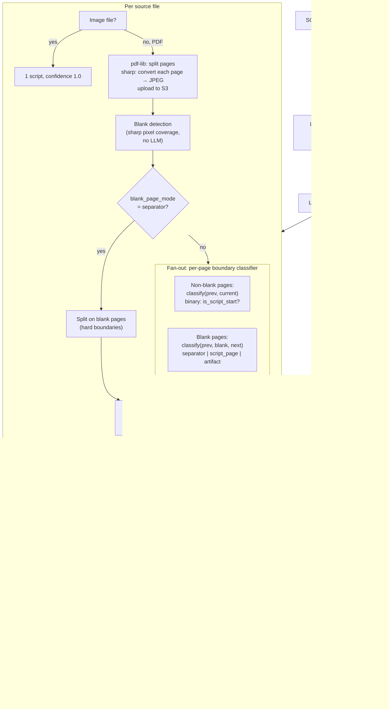

# Robust Batch Classify Pipeline

## Architecture




## Step 1 — Schema changes

**File:** `[packages/db/prisma/schema.prisma](packages/db/prisma/schema.prisma)`

Add new enum and two fields to `BatchMarkingJob`:

```prisma
enum BlankPageMode {
  script_page
  separator
}
```

On `BatchMarkingJob`:

```prisma
  blank_page_mode  BlankPageMode  @default(script_page)
  pages_per_script Int            @default(4)
```

Then run:

```bash
bun run db:generate
bun run db:push
bun run build
```

---

## Step 2 — Add sharp to backend + unit test config

**Add `sharp` to `packages/backend`:**

```bash
bun add sharp --cwd packages/backend
bun add -d @types/sharp --cwd packages/backend
```

> Note: `sharp` uses native binaries. SST's esbuild bundler needs `nodejs: { install: ["sharp"] }` added to the `batchClassifyQueue.subscribe(...)` call in `[infra/queues.ts](infra/queues.ts)` to ensure the correct `linux/x64` binary is bundled for Lambda.

**Add unit test script and config:**

Add to root `package.json` scripts:

```json
"test:unit": "vitest run tests/unit --config tests/vitest.unit.config.ts"
```

Create `tests/vitest.unit.config.ts`:

```ts
import { defineConfig } from "vitest/config"
export default defineConfig({
  test: { testTimeout: 10_000, hookTimeout: 5_000 }
})
```

---

## Step 3 — Create `blank-detection.ts` utility

**New file:** `[packages/backend/src/lib/blank-detection.ts](packages/backend/src/lib/blank-detection.ts)`

```ts
import sharp from "sharp"

export const DEFAULT_BLANK_THRESHOLD = 0.005  // 0.5% ink coverage

export async function computeInkDensity(jpegBuffer: Buffer): Promise<number> {
  const { data, info } = await sharp(jpegBuffer)
    .greyscale()
    .raw()
    .toBuffer({ resolveWithObject: true })
  const dark = data.filter((p: number) => p < 128).length
  return dark / (info.width * info.height)
}

export async function isBlankPage(
  jpegBuffer: Buffer,
  threshold = DEFAULT_BLANK_THRESHOLD,
): Promise<boolean> {
  return (await computeInkDensity(jpegBuffer)) < threshold
}
```

---

## Step 4 — Unit tests for blank detection

**New file:** `tests/unit/blank-detection.test.ts`

Tests use `sharp` to synthesise images in-memory — no S3, no sst shell needed:

- `it('flags a pure white JPEG as blank')`
- `it('does not flag a JPEG with a few dark pixels as blank')`
- `it('does not flag a greyscale form/header page as blank')` — image with ~5% ink
- `it('threshold is configurable')` — custom threshold edge cases

**Run after writing:**

```bash
bun run test:unit
```

---

## Step 5 — Rewrite `batch-classify.ts`

**File:** `[packages/backend/src/processors/batch-classify.ts](packages/backend/src/processors/batch-classify.ts)`

Full rewrite. Key structural changes from current:

**Remove:**

- `SMALL_PDF_MAX_PAGES` heuristic (5-page threshold gone)
- `splitPdfIntoPages` (replaced by JPEG conversion)
- `callGeminiForGroupings` (single-prompt bulk grouping gone)

**Add:**

`convertPdfToJpegs(pdfBytes, batchJobId, sourceKey)` → `JpegPage[]`

- pdf-lib splits into single-page PDFs
- sharp converts each to JPEG (scale so longest dimension ≤ 2480px, quality 0.92)
- Uploads `batches/{id}/pages/page-001.jpg` ... to S3
- Returns `{ absoluteIndex, jpegKey, jpegBuffer }`

`detectBlankPages(pages: JpegPage[])` → `{ blankIndices: Set<number>, nonBlankIndices: number[] }`

- Calls `computeInkDensity` per page (parallel, no LLM)

`classifyBoundariesSeparatorMode(pages, blankIndices)` → `PageGroup[]`

- Splits `nonBlankIndices` on `blankIndices`; filters empty groups

`classifyBoundariesScriptPageMode(pages, blankIndices)` → `PageGroup[]`

- Fan-out 1: per non-blank page, call `classifyPageBoundary(prevPage, currentPage)` in batches of 10
  - Prompt: binary "is this the first page of a new student script?" with structural cue list
  - Returns `{ isScriptStart: boolean | null, confidence: number }`
  - On failure/parse error → `{ isScriptStart: null, confidence: 0.0 }`
- Fan-out 2: per blank page, call `classifyBlankPage(prevPage, blankPage, nextPage)` in batches of 10
  - Returns `"separator" | "script_page" | "artifact"`
- Fan-in: walk all results in absolute order, build groups

`extractNames(scriptGroups: PageGroup[])` → adds `proposedName: string | null` to each group

- Fan-out: one Gemini call per group's first page
- Prompt: "Extract the student name if legible. Return `{ name: string | null, confidence: float }`."
- On failure → `{ name: null, confidence: 0 }`

**Auto-commit criteria (stricter than current):**

```ts
const shouldAutoCommit =
  batch.review_mode === "auto" &&
  allScripts.length > 0 &&
  allScripts.every(s => s.confidence >= AUTO_COMMIT_THRESHOLD) &&
  !hasUncertainPages &&
  scriptCountIsPlausible(allScripts.length, batch.pages_per_script, totalPages)
```

where `scriptCountIsPlausible` returns true when detected count falls within `[total / (pps * 3), total / (pps * 0.5)]`.

---

## Step 6 — Update `batch-actions.ts` and `batch-marking-dialog.tsx`

`**[apps/web/src/lib/batch-actions.ts](apps/web/src/lib/batch-actions.ts)`:** extend `createBatchMarkingJob` signature:

```ts
createBatchMarkingJob(
  examPaperId: string,
  reviewMode: ReviewMode = "auto",
  blankPageMode: BlankPageMode = "script_page",
  pagesPerScript: number = 4,
)
```

`**[apps/web/src/app/teacher/exam-papers/[id]/batch-marking-dialog.tsx](apps/web/src/app/teacher/exam-papers/[id]/batch-marking-dialog.tsx)`:** add to Phase 1 (upload) an expandable "Advanced" section:

- `pages_per_script` number input (label: "Approx. pages per student script", min 1, max 20, default 4)
- `blank_page_mode` toggle (label: "Treat blank pages as script separators", default off)

---

## Step 7 — Upload flow unification

### A. Upgrade `UploadStudentScriptDialog`

**File:** `[apps/web/src/app/teacher/exam-papers/[id]/upload-student-script-dialog.tsx](apps/web/src/app/teacher/exam-papers/[id]/upload-student-script-dialog.tsx)`

Add page reordering — the one feature `mark/new/page.tsx` has that the dialog lacks.

New imports:

```ts
import { ArrowDown, ArrowUp, FileText, Trash2, Upload } from "lucide-react"
import { addPageToJob, createStudentPaperJob, reorderPages, triggerOcr } from "@/lib/mark-actions"
```

New handlers (add alongside existing `handleRemove`):

```ts
async function handleMove(order: number, direction: "up" | "down") {
  const idx = pages.findIndex(p => p.order === order)
  if (idx < 0) return
  const swapIdx = direction === "up" ? idx - 1 : idx + 1
  if (swapIdx < 0 || swapIdx >= pages.length) return

  const reordered = [...pages]
  ;[reordered[idx], reordered[swapIdx]] = [reordered[swapIdx]!, reordered[idx]!]
  const renumbered = reordered.map((p, i) => ({ ...p, order: i + 1 }))
  setPages(renumbered)

  // Persist to DB for already-uploaded pages only
  const jid = jobIdRef.current
  const uploadedKeys = renumbered.filter(p => p.key).map(p => p.key)
  if (jid && uploadedKeys.length > 0) {
    await reorderPages(jid, uploadedKeys)
  }
}
```

In the page list, add up/down buttons to each row when `!page.uploading && pages.length > 1`:

```tsx
<div className="flex flex-col gap-0.5">
  <button type="button" disabled={idx === 0} onClick={() => handleMove(page.order, "up")}
    className="p-1 rounded text-muted-foreground hover:bg-muted disabled:opacity-30">
    <ArrowUp className="h-3 w-3" />
  </button>
  <button type="button" disabled={idx === pages.length - 1} onClick={() => handleMove(page.order, "down")}
    className="p-1 rounded text-muted-foreground hover:bg-muted disabled:opacity-30">
    <ArrowDown className="h-3 w-3" />
  </button>
</div>
```

---

### B. Delete `mark/new/page.tsx`

**Delete:** `[apps/web/src/app/teacher/mark/new/page.tsx](apps/web/src/app/teacher/mark/new/page.tsx)`

The dialog is always opened in the context of a known exam paper (via the FAB on the exam paper page), so the separate full-page upload flow is no longer needed.

---

### C. Update the 5 link sites

All current links to `/teacher/mark/new` are replaced. Sites that have `examPaperId` in scope link directly to that paper; others link to `/teacher/exam-papers`.


| File                                                                                                                      | Line | Old                               | New                                                                                              |
| ------------------------------------------------------------------------------------------------------------------------- | ---- | --------------------------------- | ------------------------------------------------------------------------------------------------ |
| `[mark/page.tsx](apps/web/src/app/teacher/mark/page.tsx)`                                                                 | 151  | `href="/teacher/mark/new"` button | `href="/teacher/exam-papers"` — label: "Browse exam papers"                                      |
| `[mark/page.tsx](apps/web/src/app/teacher/mark/page.tsx)`                                                                 | 173  | `href="/teacher/mark/new"` button | `href="/teacher/exam-papers"` — label: "Browse exam papers"                                      |
| `[submission-toolbar.tsx](apps/web/src/app/teacher/mark/papers/[examPaperId]/submissions/[jobId]/submission-toolbar.tsx)` | 335  | `href="/teacher/mark/new"`        | `href={\`/teacher/exam-papers/${examPaperId}}`—`examPaperId` is already a prop on this component |
| `[unified-marking-layout.tsx](apps/web/src/app/teacher/mark/[jobId]/unified-marking-layout.tsx)`                          | 137  | `href="/teacher/mark/new"`        | `href="/teacher/exam-papers"` — no examPaperId in scope                                          |
| `[failed.tsx](apps/web/src/app/teacher/mark/[jobId]/phases/failed.tsx)`                                                   | 26   | `href="/teacher/mark/new"`        | `href="/teacher/exam-papers"`                                                                    |
| `[cancelled.tsx](apps/web/src/app/teacher/mark/[jobId]/phases/cancelled.tsx)`                                             | 18   | `href="/teacher/mark/new"`        | `href="/teacher/exam-papers"`                                                                    |


---

## Step 8 — Integration tests

**File:** `[tests/integration/batch-classify.test.ts](tests/integration/batch-classify.test.ts)`

Add a new `describe("blank page handling")` block. All tests use `review_mode: "required"` and assert `status === "staging"` (never `marking`) — no OCR triggered.

New tests:


| Test                                                    | File                  | blank_page_mode | Expected staged_scripts        |
| ------------------------------------------------------- | --------------------- | --------------- | ------------------------------ |
| drops start/end blanks, separates middle scripts        | `start-end-blank.pdf` | `separator`     | `=== 2`                        |
| blank separator mode: no empty groups created           | `start-end-blank.pdf` | `separator`     | none have 0 page_keys          |
| blank as script_page mode resolves via context          | `start-end-blank.pdf` | `script_page`   | `=== 2`                        |
| blank interior to single script (Option A: kept)        | `random-blank.pdf`    | `script_page`   | `=== 1`                        |
| blank_page_mode=separator splits single script at blank | `random-blank.pdf`    | `separator`     | `=== 2` (documented behaviour) |


**Run after writing:**

```bash
npx sst shell -- vitest run tests/integration/batch-classify.test.ts --config tests/vitest.config.ts
```

---

## Build order summary

```
1.  Schema changes
2.  bun run db:generate && bun run db:push && bun run build
3.  Add sharp to backend + infra nodejs.install config + unit test config
4.  Create blank-detection.ts
5.  Write tests/unit/blank-detection.test.ts
6.  ✅ bun run test:unit
7.  Rewrite batch-classify.ts
8.  Update batch-actions.ts + batch-marking-dialog.tsx
9.  Add page reordering to UploadStudentScriptDialog
10. Delete mark/new/page.tsx + update 5 link sites
11. Write new integration tests in batch-classify.test.ts
12. ✅ npx sst shell -- vitest run tests/integration/batch-classify.test.ts
```

> Note: Steps 9–10 (upload flow changes) are frontend-only and independent of steps 7–8. They can be done in parallel or in any order relative to the backend work.

