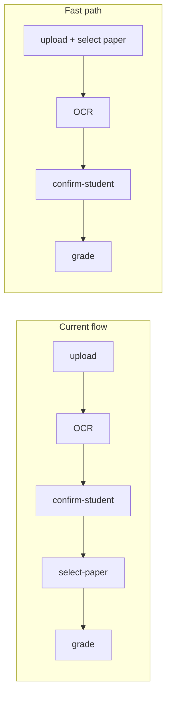

# Select Paper First Flow

## New flow vs current flow




When a paper is pre-selected before upload:

- `triggerOcr` writes `exam_paper_id` onto the job before enqueuing
- The OCR handler detects `exam_paper_id` is already set and auto-enqueues to `StudentPaperQueue` instead of sitting at `text_extracted`
- Grading runs concurrently while the teacher confirms the student
- The `select-paper` step is skipped entirely in the UI

---

## Files changed

### 1. `[apps/web/src/lib/mark-actions.ts](apps/web/src/lib/mark-actions.ts)`

Extend `triggerOcr` to accept an optional `examPaperId`:

```typescript
export async function triggerOcr(
  jobId: string,
  examPaperId?: string,
): Promise<TriggerOcrResult>
```

When `examPaperId` is provided, also update the job with `exam_paper_id` + `exam_board` / `subject` / `year` (looked up from `ExamPaper`) before enqueuing — the same fields `triggerGrading` currently sets. The SQS message stays `{ job_id }` unchanged; the OCR handler reads the fields from the DB row.

### 2. `[packages/backend/src/processors/student-paper-ocr.ts](packages/backend/src/processors/student-paper-ocr.ts)`

After writing `extracted_answers_raw` / `page_analyses` / `student_name`, branch on whether `job.exam_paper_id` is set:

```typescript
if (job.exam_paper_id) {
  // Fast path: skip text_extracted, auto-queue grading
  await db.pdfIngestionJob.update({
    where: { id: jobId },
    data: { status: "pending", ...ocrFields, error: null },
  })
  await sqs.send(new SendMessageCommand({
    QueueUrl: Resource.StudentPaperQueue.url,
    MessageBody: JSON.stringify({ job_id: jobId }),
  }))
} else {
  // Slow path: existing behaviour
  await db.pdfIngestionJob.update({
    where: { id: jobId },
    data: { status: "text_extracted", ...ocrFields, error: null },
  })
}
```

The `StudentPaperQueue` resource binding is already present on this Lambda (both handlers share the same `link` array in `infra/queues.ts`). No infra change needed.

### 3. `[apps/web/src/app/teacher/mark/new/page.tsx](apps/web/src/app/teacher/mark/new/page.tsx)`

**New state:**

```typescript
const [preSelectedPaper, setPreSelectedPaper] = useState<CatalogExamPaper | null>(null)
const [showPaperPicker, setShowPaperPicker] = useState(false)
```

Papers are loaded lazily when the picker is first opened (reuse `listCatalogExamPapers`).

**Upload step UI** — add a collapsible section above the "Extract answers" CTA:

- A subtle "Select exam paper now (optional)" toggle link
- When open: the same paper search + card list that currently lives in `select-paper`, showing all papers unfiltered (no detected subject yet)
- When a paper is selected: shows a chip + a dismiss button; `showPaperPicker` collapses

`**handleTriggerOcr` change:**

```typescript
const result = await triggerOcr(jobIdRef.current, preSelectedPaper?.id)
```

`**pollOcr` change** — no change needed; `confirm-student` is still the next step in both paths.

`**handleConfirmStudent` change** — the final call currently is always `proceedToPaperSelect()`. Split:

```typescript
if (preSelectedPaper) {
  setStep("processing-grade")   // grading already queued by OCR handler
} else {
  proceedToPaperSelect()        // existing flow
}
```

The "Skip for now" button on the confirm-student screen also needs the same split.

`**pollGrading**` — no change needed; it already polls for `"ocr_complete"` regardless of how grading was triggered.

---

## What does NOT change

- `student-paper-pdf.ts` (grading handler) — unchanged; it already reads `exam_paper_id` from the job
- `infra/queues.ts` — no new queues or Lambda bindings needed
- `continue-marking-client.tsx` — unchanged; only reached via `page.tsx` for jobs already at `text_extracted` (the slow path still works)
- The `select-paper` step still exists for the slow path; nothing is removed

