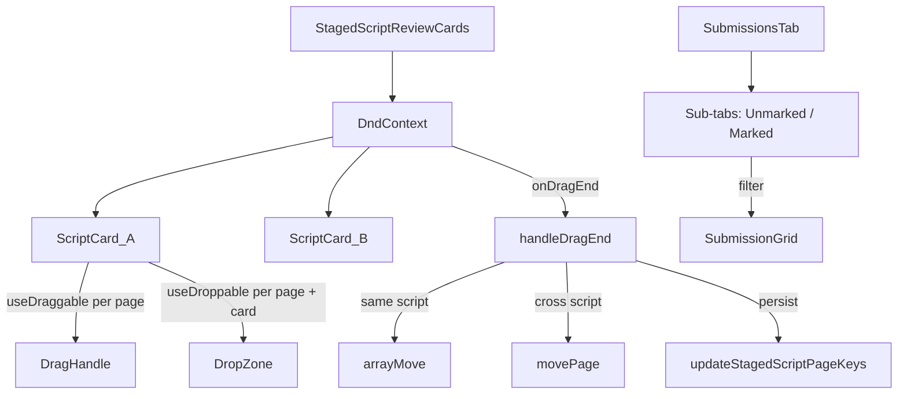

# Staging UI + Submissions Tabs

## What changes

### 1. Remove "Edit pages" mode

- Delete `StagedScriptPageEditor` from `[staged-script-page-editor.tsx](apps/web/src/app/teacher/exam-papers/[id]/staged-script-page-editor.tsx)` (keep only `PageCarousel` and `PageItem` which are still used for the carousel in the review cards)
- Remove `editingPages` state, the "Edit pages / Done editing" toggle, and the `StagedScriptPageEditor` render from `[exam-paper-page-shell.tsx](apps/web/src/app/teacher/exam-papers/[id]/exam-paper-page-shell.tsx)` (around lines 899–970)

### 2. Add drag-and-drop + delete to StagedScriptReviewCards

File: `[batch-marking-dialog.tsx](apps/web/src/app/teacher/exam-papers/[id]/batch-marking-dialog.tsx)` — `StagedScriptReviewCards` component

**New props:**

```ts
onDeleteScript: (scriptId: string) => void
onMovePage: (pageKey: string, fromScriptId: string, toScriptId: string, insertBeforeKey?: string) => void
onReorderPage: (scriptId: string, pageKey: string, newIndex: number) => void
```

**Each script card gets a `DndContext` at the `StagedScriptReviewCards` level** wrapping all cards. Each page thumbnail is:

- `useDraggable({ id: pageKey })` — drag handle (GripVertical icon on hover)
- `useDroppable({ id: pageKey })` — drop target for position-aware reordering
- Each script card body uses `useDroppable({ id: scriptId })` — drop target for cross-card moves

`**onDragEnd` logic** (same proven pattern from the page editor):

- `over.id` is a page key in same script → `arrayMove` reorder, persist
- `over.id` is a page key in different script → remove from source, insert before target, persist both
- `over.id` is a script id → append to end of that script, persist both

**Delete button:** Replace the "Exclude" button with two actions:

- "Exclude" (soft, reversible — existing behaviour)
- "Delete" (hard — calls new `deleteStagedScript` server action, removes card from local state immediately)

### 3. New server action: `deleteStagedScript`

File: `[batch-actions.ts](apps/web/src/lib/batch-actions.ts)`

```ts
export async function deleteStagedScript(
  scriptId: string,
): Promise<{ ok: true } | { ok: false; error: string }>
```

Does `db.stagedScript.delete({ where: { id: scriptId } })` after verifying ownership via `batch_job.uploaded_by === session.userId`.

### 4. Submissions sub-tabs: Unmarked / Marked

File: `[submission-grid.tsx](apps/web/src/app/teacher/exam-papers/[id]/submission-grid.tsx)` and `[exam-paper-page-shell.tsx](apps/web/src/app/teacher/exam-papers/[id]/exam-paper-page-shell.tsx)`

Split `initialSubmissions` inside the submissions `TabsContent` using a sub-tab row (simple `Tabs` / `TabsList` from the existing UI components):

- **Unmarked** — `status !== "ocr_complete"` and `total_max === 0` (processing, failed, pending)
- **Marked** — `status === "ocr_complete"` or `total_max > 0` (has grading results)

The split happens client-side in `SubmissionGrid` (or just above it in the shell). No new server call needed — `initialSubmissions` already has all statuses.

Tab state synced with `?submissions_tab=unmarked|marked` via `nuqs` (consistent with the existing pattern in the file).

## Data flow




## Files touched

- `[batch-marking-dialog.tsx](apps/web/src/app/teacher/exam-papers/[id]/batch-marking-dialog.tsx)` — add DnD + delete to `StagedScriptReviewCards`
- `[batch-actions.ts](apps/web/src/lib/batch-actions.ts)` — add `deleteStagedScript`
- `[exam-paper-page-shell.tsx](apps/web/src/app/teacher/exam-papers/[id]/exam-paper-page-shell.tsx)` — remove edit mode, wire new callbacks, add sub-tabs
- `[staged-script-page-editor.tsx](apps/web/src/app/teacher/exam-papers/[id]/staged-script-page-editor.tsx)` — remove `StagedScriptPageEditor`, keep `PageCarousel` + `PageItem`
- `[submission-grid.tsx](apps/web/src/app/teacher/exam-papers/[id]/submission-grid.tsx)` — accept optional filter or move sub-tab logic here

