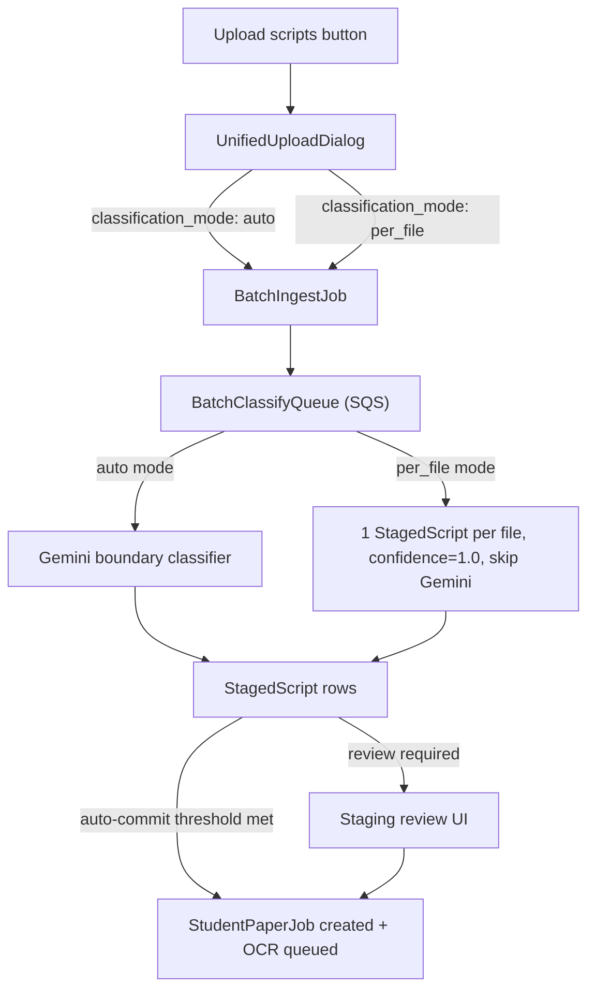

# Upload Flow Unification

## Goal

Replace the two separate upload paths (single-script via `createStudentPaperJob` + `triggerOcr`, and batch ingest via `BatchIngestJob`) with a single unified path that always goes through `BatchIngestJob → StagedScript → StudentPaperJob`.

## New data flow




## What changes

### 1. Schema — `[packages/db/prisma/schema.prisma](packages/db/prisma/schema.prisma)`

Add `classification_mode` enum and field to `BatchIngestJob`:

```prisma
enum ClassificationMode {
  auto
  per_file
}

model BatchIngestJob {
  // existing fields...
  classification_mode ClassificationMode @default(auto)
}
```

Migration: `npx prisma migrate dev --name add_classification_mode`

### 2. Backend classifier — `[packages/backend/src/processors/batch-classify.ts](packages/backend/src/processors/batch-classify.ts)`

In `classifyBatch`, branch on `batch.classification_mode`:

- `per_file`: for each source file, create one `StagedScript` directly (all pages in order, `confidence: 1.0`, `status: confirmed`). Skip all Gemini calls. Proceed straight to staging or auto-commit.
- `auto`: existing logic unchanged.

Add a page-count guard in `per_file` mode: if a file's page count is `> pages_per_script * 2`, set a `hasUncertainPage: true` equivalent so the staging UI can warn.

### 3. Server actions — `[apps/web/src/lib/batch-actions.ts](apps/web/src/lib/batch-actions.ts)`

- Update `createBatchIngestJob` to accept `classificationMode: "auto" | "per_file"` and persist it.
- Update `updateBatchJobSettings` to allow changing `classification_mode`.
- No changes to `commitBatch`, `updateStagedScript`, `splitStagedScript` — they already work generically.

### 4. New unified dialog — `apps/web/src/app/teacher/exam-papers/[id]/upload-scripts-dialog.tsx`

Replace `BatchIngestDialog` and `UploadStudentScriptDialog` with a single component. Essentially `BatchIngestDialog` with:

- Renamed/simplified header: "Upload student scripts"
- Default mode: `auto`. Toggle in advanced panel: "Each file is one student's script" → sets `per_file`.
- Remove the client-side PDF → JPEG conversion that existed in `UploadStudentScriptDialog` (the batch pipeline handles this server-side already via `extractPdfPages`).
- Staging phase: when a staged script in `per_file` mode has significantly more pages than `pages_per_script`, show a page-count warning badge and surface the **Split** action prominently on the card.

### 5. FAB + shell — `[apps/web/src/app/teacher/exam-papers/[id]/exam-paper-page-shell.tsx](apps/web/src/app/teacher/exam-papers/[id]/exam-paper-page-shell.tsx)`

- Replace the split pill button (lines 1060–1079) with a single "Upload scripts" button.
- Remove `uploadScriptOpen` / `batchOpen` state; replace with single `uploadOpen` state.
- Remove `UploadStudentScriptDialog` import and usage (lines 1018–1035).
- Remove `MarkingJobDialog` usage — the single-script flow no longer bypasses staging to open the submission view directly. After commit, the submission appears in the `SubmissionGrid` like any batch job.
- Keep `activeBatch` polling and `SubmissionGrid` unchanged.

### 6. Delete obsolete files

- `apps/web/src/app/teacher/exam-papers/[id]/upload-student-script-dialog.tsx`
- `apps/web/src/lib/marking/mutations.ts` — check if `createStudentPaperJob`, `addPageToJob`, `reorderPages`, `triggerOcr` are used anywhere else; if not, remove.

## What stays the same

- `StagedScript` schema — no changes, `batch_job_id` stays non-nullable.
- `commitBatch` / `commitBatchService` — already creates `StudentPaperJob` rows generically from confirmed staged scripts.
- `StagedScriptReviewCards`, `DndScriptCard`, `splitStagedScript` — all work on `StagedScript.page_keys` and are mode-agnostic.
- `MarkingJobDialog` can be kept for deep-linking to a specific job via `?job=` query param but is no longer opened automatically after upload.

## Modes at a glance

- `auto` (default): Gemini classifies boundaries per file. Handles single scripts, multi-student PDFs, and mixed batches. Safe for all teachers.
- `per_file`: skips Gemini, one staged script per file. For power users with known one-per-file uploads. Staging UI warns if a script looks oversized.

