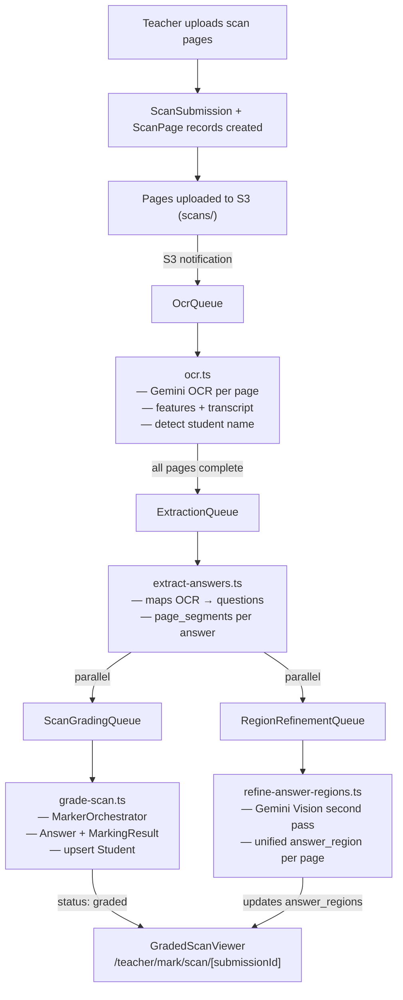
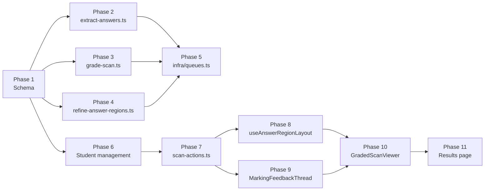

# Scan Grading & Inline Feedback — Build Plan

## Context: Two Existing Flows

Two separate grading flows exist today and must be reconciled:

**Flow A — `PdfIngestionJob`** (`mark-actions.ts` → `student-paper-ocr.ts` → `student-paper-pdf.ts`):
- Teacher uploads images → `PdfIngestionJob` record created
- OCR via `StudentPaperOcrQueue` → raw text + student name extracted → `extracted_answers_raw` JSON blob
- Teacher selects exam paper → `StudentPaperQueue` → `MarkerOrchestrator` runs → `grading_results` JSON blob on the job
- **Has grading. Has no spatial data.**

**Flow B — `ScanSubmission`** (`scan-actions.ts` → `ocr.ts` → `extract-answers.ts`):
- Teacher uploads images → `ScanSubmission` + `ScanPage` records
- OCR auto-triggered via S3 notification → `ScanPage.ocr_result` (features, bounding boxes, transcript)
- Extraction auto-triggered → `ExtractedAnswer` records with per-question bounding boxes
- Status reaches `extracted` → **then nothing happens**
- **Has spatial data. Has no grading.**

**Goal:** Complete Flow B end-to-end — add grading, a proper `Student` model, and an inline feedback UI that overlays marks on the scan images.



---

## Phase 1 — Schema Migration

**Files:** [`packages/db/prisma/schema.prisma`](packages/db/prisma/schema.prisma)

### 1a. New `Student` model

Add before `Answer`:

```prisma
model Student {
  id          String   @id @default(cuid())
  name        String
  class_name  String?
  year_group  String?
  teacher_id  String
  created_at  DateTime @default(now())
  updated_at  DateTime @updatedAt

  teacher          User             @relation("TeacherStudents", fields: [teacher_id], references: [id])
  scan_submissions ScanSubmission[] @relation("StudentScans")
  answers          Answer[]         @relation("StudentAnswers")

  @@map("students")
}
```

On `User`: remove the `student_answers Answer[] @relation("StudentAnswers")` and `scan_submissions ScanSubmission[] @relation("StudentScans")` relations. Add `students Student[] @relation("TeacherStudents")`.

### 1b. Update `ScanSubmission`

```diff
 model ScanSubmission {
   id            String     @id @default(cuid())
-  student_id    String
+  student_id    String?
   exam_paper_id String
   status        ScanStatus @default(pending)
   page_count    Int
   uploaded_at   DateTime   @default(now())
   processed_at  DateTime?
   error_message String?
+  detected_student_name String?
   metadata      Json?

-  student    User       @relation("StudentScans", fields: [student_id], references: [id])
+  student    Student?   @relation("StudentScans", fields: [student_id], references: [id])
   exam_paper ExamPaper  @relation(fields: [exam_paper_id], references: [id])
   pages      ScanPage[]
+  extracted_answers ExtractedAnswer[]
```

`student_id` is nullable because the student is confirmed after OCR, not at upload time.

### 1c. Update `Answer`

```diff
-  student          User             @relation("StudentAnswers", fields: [student_id], references: [id])
+  student          Student          @relation("StudentAnswers", fields: [student_id], references: [id])
```

### 1d. Restructure `ExtractedAnswer`

```diff
 model ExtractedAnswer {
   id               String   @id @default(cuid())
-  scan_page_id     String
+  scan_submission_id String
   question_id      String
   question_part_id String?
   extracted_text   String
-  // [{ box_2d: [y,x,y,x], label, feature_type }]
-  bounding_boxes   Json
+  // [{ page_number, scan_page_id, segment_text, bounding_boxes: [{ box_2d, label, feature_type }] }]
+  page_segments    Json
+  // [{ page_number, scan_page_id, answer_region: [yMin, xMin, yMax, xMax] }] — set by region refinement Lambda
+  answer_regions   Json?
   confidence       Float?
   answer_id        String?  @unique
   created_at       DateTime @default(now())

-  scan_page     ScanPage      @relation(fields: [scan_page_id], references: [id])
+  scan_submission ScanSubmission @relation(fields: [scan_submission_id], references: [id])
   question      Question      @relation(fields: [question_id], references: [id])
   question_part QuestionPart? @relation(fields: [question_part_id], references: [id])
   answer        Answer?       @relation(fields: [answer_id], references: [id])

+  @@unique([scan_submission_id, question_id, question_part_id])
   @@map("extracted_answers")
 }
```

Remove `extracted_answers ExtractedAnswer[]` from `ScanPage` (back-relation no longer valid).

### 1e. New `ScanStatus` values

```diff
 enum ScanStatus {
   pending
   processing
   text_extracted
   ocr_complete
   extracting
   extracted
+  grading
+  graded
   failed
   cancelled
 }
```

### 1f. Run migration

```bash
pnpm --filter @mcp-gcse/db exec prisma migrate dev --name scan-grading-student-model
```

---

## Phase 2 — Update `extract-answers.ts`

**File:** [`packages/backend/src/processors/extract-answers.ts`](packages/backend/src/processors/extract-answers.ts)

### 2a. New Gemini output schema

Replace the existing `EXTRACTION_SCHEMA` with one that groups by question (not page) and includes per-page segments:

```typescript
const EXTRACTION_SCHEMA = {
  type: Type.OBJECT,
  properties: {
    extractions: {
      type: Type.ARRAY,
      items: {
        type: Type.OBJECT,
        properties: {
          question_id: { type: Type.STRING },
          question_part_id: { type: Type.STRING, nullable: true },
          // Full concatenated text across all pages — used for grading
          extracted_text: { type: Type.STRING },
          confidence: { type: Type.NUMBER },
          page_segments: {
            type: Type.ARRAY,
            items: {
              type: Type.OBJECT,
              properties: {
                page_number: { type: Type.INTEGER },
                segment_text: { type: Type.STRING },
                bounding_boxes: {
                  type: Type.ARRAY,
                  items: {
                    type: Type.OBJECT,
                    properties: {
                      box_2d: { type: Type.ARRAY, items: { type: Type.INTEGER } },
                      label: { type: Type.STRING },
                      feature_type: { type: Type.STRING },
                    },
                    required: ["box_2d", "label", "feature_type"],
                  },
                },
              },
              required: ["page_number", "segment_text", "bounding_boxes"],
            },
          },
        },
        required: ["question_id", "extracted_text", "page_segments"],
      },
    },
  },
  required: ["extractions"],
}
```

Update the Gemini prompt to instruct: "If an answer spans multiple pages, group all segments under a single extraction item. Be explicit about which page each segment belongs to using the page_number."

### 2b. Update `db.extractedAnswer.create`

```typescript
await db.extractedAnswer.create({
  data: {
    scan_submission_id: scan_submission_id,  // was: scan_page_id
    question_id: ext.question_id,
    question_part_id: ext.question_part_id ?? null,
    extracted_text: ext.extracted_text,
    page_segments: ext.page_segments as unknown as object,
    confidence: ext.confidence ?? null,
  },
})
```

### 2c. Enqueue to both new queues after extraction completes

Replace the existing `ScanStatus.extracted` update block:

```typescript
await db.scanSubmission.update({
  where: { id: scan_submission_id },
  data: { status: ScanStatus.extracted, processed_at: new Date() },
})

await Promise.all([
  sqs.send(new SendMessageCommand({
    QueueUrl: Resource.ScanGradingQueue.url,
    MessageBody: JSON.stringify({ scan_submission_id }),
  })),
  sqs.send(new SendMessageCommand({
    QueueUrl: Resource.RegionRefinementQueue.url,
    MessageBody: JSON.stringify({ scan_submission_id }),
  })),
])
```

Add `ScanGradingQueue` and `RegionRefinementQueue` to the Lambda's `link` array in [`infra/queues.ts`](infra/queues.ts) (Phase 5).

---

## Phase 3 — New `grade-scan.ts` Lambda

**File:** `packages/backend/src/processors/grade-scan.ts` (new)

Mirrors `student-paper-pdf.ts` but targets `ScanSubmission`/`ExtractedAnswer` instead of `PdfIngestionJob`.

```typescript
export async function handler(event: SqsEvent) {
  // 1. Parse scan_submission_id from SQS body
  // 2. Load ScanSubmission with:
  //    - exam_paper.sections.exam_section_questions.question.mark_schemes
  //    - extracted_answers
  //    - pages (for student name detection fallback)
  // 3. Guard: status must be `extracted`
  // 4. Set status = ScanStatus.grading
  //
  // 5. Upsert Student record (see below)
  //
  // 6. For each ExtractedAnswer:
  //    a. Find matching Question + MarkScheme from the exam paper
  //    b. Create Answer {
  //         student_id: student.id,
  //         question_id, question_part_id,
  //         student_answer: extractedAnswer.extracted_text,
  //         source: "scanned",
  //         max_possible_score: markScheme.points_total,
  //       }
  //    c. Run MarkerOrchestrator (identical setup to student-paper-pdf.ts)
  //    d. Create MarkingResult {
  //         answer_id: answer.id,
  //         mark_scheme_id: markScheme.id,
  //         ...grade results
  //       }
  //    e. db.extractedAnswer.update({ where: { id }, data: { answer_id: answer.id } })
  //
  // 7. Set ScanSubmission.status = ScanStatus.graded
}
```

**Student upsert logic:**

```typescript
async function upsertStudent(
  db: PrismaClient,
  teacherId: string,   // ScanSubmission was uploaded by this teacher (via session)
  detectedName: string | null,
): Promise<Student> {
  if (!detectedName) {
    // Create anonymous placeholder — teacher can rename later
    return db.student.create({ data: { name: "Unknown Student", teacher_id: teacherId } })
  }
  const existing = await db.student.findFirst({
    where: {
      teacher_id: teacherId,
      name: { equals: detectedName, mode: "insensitive" },
    },
  })
  if (existing) return existing
  return db.student.create({ data: { name: detectedName, teacher_id: teacherId } })
}
```

Note: `teacherId` is obtained from `ScanSubmission` — need to track the uploading teacher. Add `uploaded_by_id String` to `ScanSubmission` pointing at `User`, set in `scan-actions.ts` at upload time.

**MarkerOrchestrator setup** — identical to [`packages/backend/src/processors/student-paper-pdf.ts`](packages/backend/src/processors/student-paper-pdf.ts) lines 57–65:

```typescript
const grader = new Grader(defaultChatModel(), {
  systemPrompt:
    "You are an expert GCSE examiner. Mark the student's answer against the provided mark scheme...",
})
const orchestrator = new MarkerOrchestrator([
  new DeterministicMarker(),
  new LevelOfResponseMarker(grader),
  new LlmMarker(grader),
])
```

---

## Phase 4 — New `refine-answer-regions.ts` Lambda

**File:** `packages/backend/src/processors/refine-answer-regions.ts` (new)

Runs in parallel with Phase 3. Does not block the grading result from appearing.

```typescript
export async function handler(event: SqsEvent) {
  // 1. Load ScanSubmission.pages (with s3_key, s3_bucket) + extracted_answers
  // 2. For each ScanPage:
  //    a. Fetch image from S3 → base64
  //    b. Find ExtractedAnswers whose page_segments include this page_number
  //    c. Build question list for this page:
  //       [{ question_id, question_number, question_text }]
  //       (question_number = the display number e.g. "1", "2a" from ExamSectionQuestion.order)
  //    d. Call Gemini Vision:
  //       model: "gemini-2.5-flash"
  //       contents: [{ image base64 }, { text: prompt }]
  //       Prompt: "You are examining a student's handwritten exam script.
  //                For each question below, identify the region where the student has written
  //                their answer (including all lines, even if sparse or crossed out) and return
  //                a single bounding box encompassing the entire answer region.
  //                If a question was not answered on this page, set found: false.
  //
  //                Questions: [{ question_id, number, text }]
  //
  //                Return JSON: { regions: [{ question_id, answer_region: [yMin,xMin,yMax,xMax], found: bool }] }"
  //       responseSchema: structured output matching above
  //    e. For each result where found=true:
  //       db.extractedAnswer.update({
  //         where: { ... },
  //         data: {
  //           answer_regions: [
  //             ...existing,
  //             { page_number, scan_page_id: page.id, answer_region: result.answer_region }
  //           ]
  //         }
  //       })
  // 3. No status update — grading Lambda owns status
}
```

---

## Phase 5 — Infra: New Queues

**File:** [`infra/queues.ts`](infra/queues.ts)

Add at the end:

```typescript
export const scanGradingQueue = new sst.aws.Queue("ScanGradingQueue", {
  visibilityTimeout: "10 minutes",
})

export const regionRefinementQueue = new sst.aws.Queue("RegionRefinementQueue", {
  visibilityTimeout: "8 minutes",
})

scanGradingQueue.subscribe({
  handler: "packages/backend/src/processors/grade-scan.handler",
  link: [neonPostgres, geminiApiKey, openAiApiKey],
  timeout: "8 minutes",
  memory: "512 MB",
})

regionRefinementQueue.subscribe({
  handler: "packages/backend/src/processors/refine-answer-regions.handler",
  link: [neonPostgres, geminiApiKey, scansBucket],
  timeout: "6 minutes",
  memory: "512 MB",
})
```

Update the `extractionQueue` subscriber to add the two new queues to its `link` array:

```typescript
extractionQueue.subscribe({
  handler: "packages/backend/src/processors/extract-answers.handler",
  link: [neonPostgres, geminiApiKey, openAiApiKey, scanGradingQueue, regionRefinementQueue],
  timeout: "3 minutes",
})
```

Export both from [`infra/index.ts`](infra/index.ts).

---

## Phase 6 — Student Management

### 6a. Name detection in `ocr.ts`

**File:** [`packages/backend/src/processors/ocr.ts`](packages/backend/src/processors/ocr.ts)

After all pages reach `ocr_complete` and before enqueueing extraction, run a lightweight Gemini text call on the page 1 transcript:

```typescript
async function detectStudentName(transcript: string): Promise<string | null> {
  const response = await client.models.generateContent({
    model: "gemini-2.5-flash",
    contents: [{
      role: "user",
      parts: [{ text: `This is an OCR transcript of a student exam paper cover page.
Extract only the student's full name as written. Return ONLY the name string, or null if not found.

Transcript:
${transcript}` }],
    }],
    config: { responseMimeType: "application/json", temperature: 0 },
  })
  // Parse response — expect "\"Name\"" or "null"
}
```

Store the result:

```typescript
await db.scanSubmission.update({
  where: { id: scanSubmissionId },
  data: { detected_student_name: detectedName },
})
```

### 6b. New `student-actions.ts` server actions

**File:** `apps/web/src/lib/student-actions.ts` (new)

```typescript
"use server"

export async function listStudents(): Promise<ListStudentsResult>
export async function createStudent(name: string, className?: string, yearGroup?: string): Promise<CreateStudentResult>
export async function updateStudent(id: string, data: { name?: string, class_name?: string, year_group?: string }): Promise<UpdateStudentResult>
export async function confirmStudentForSubmission(submissionId: string, studentId: string): Promise<ConfirmStudentResult>
// Creates a new Student and links to submission in one call
export async function createAndConfirmStudent(submissionId: string, name: string, className?: string): Promise<CreateStudentResult>
```

### 6c. Upload flow: "Confirm student" step

**File:** [`apps/web/src/app/teacher/mark/new/page.tsx`](apps/web/src/app/teacher/mark/new/page.tsx)

Add `"confirm-student"` step between `"processing-ocr"` and `"select-paper"`:

```typescript
type Step = "upload" | "processing-ocr" | "confirm-student" | "select-paper" | "processing-grade"
```

When OCR completes (`status === "text_extracted"`): instead of going directly to `"select-paper"`, transition to `"confirm-student"`.

The confirm-student UI shows:
- Detected name chip (green if found, amber if not found)
- Dropdown of existing students (fuzzy search)
- "Create new student" option pre-filled with detected name
- "Skip for now" option

On confirm: call `confirmStudentForSubmission` → then set step to `"select-paper"`.

### 6d. Update `scan-actions.ts` upload

**File:** [`apps/web/src/lib/scan-actions.ts`](apps/web/src/lib/scan-actions.ts)

In `createScanUpload`: add `uploaded_by_id: session.userId` when creating the `ScanSubmission` (needed by the grading Lambda to resolve the teacher for Student upsert).

---

## Phase 7 — `scan-actions.ts`: `getGradedSubmission`

**File:** [`apps/web/src/lib/scan-actions.ts`](apps/web/src/lib/scan-actions.ts)

Add new exported types and action:

```typescript
export type MarkPointResult = {
  pointNumber: number
  awarded: boolean
  reasoning: string
  expectedCriteria: string
  studentCovered: string
}

export type GradedAnswerOnPage = {
  extractedAnswerId: string
  questionId: string
  questionText: string
  questionNumber: string
  extractedText: string
  awardedScore: number
  maxScore: number
  feedbackSummary: string
  llmReasoning: string
  levelAwarded?: number
  markPointResults: MarkPointResult[]
  // Boxes for this page only, from page_segments
  boundingBoxes: HandwritingFeature[]
  // Refined single-region for this page (null until RegionRefinementQueue completes)
  answerRegion: [number, number, number, number] | null
  // True if this is not the first page of the answer
  isContinuation: boolean
}

export type GradedPage = {
  pageNumber: number
  imageUrl: string
  gradedAnswers: GradedAnswerOnPage[]
}

export type GetGradedSubmissionResult =
  | { ok: true; status: string; student: { name: string } | null; totalAwarded: number; totalMax: number; pages: GradedPage[] }
  | { ok: false; error: string }

export async function getGradedSubmission(submissionId: string): Promise<GetGradedSubmissionResult>
```

Logic:
1. Load `ScanSubmission` with `student`, `pages` ordered by `page_number`, and `extracted_answers` including nested `answer.marking_results`, `question` (for text and number)
2. Generate presigned GET URLs (1 hour) for each page's S3 image
3. For each `ScanPage`:
   - Find all `ExtractedAnswer` records whose `page_segments` contain an entry for this `page_number`
   - For each such answer, extract the segment's `bounding_boxes` and look up the `answer_region` for this page from `answer_regions`
   - Pull score and feedback from the nested `Answer.MarkingResult`
   - Mark `isContinuation: true` if this page_number is not the smallest page_number in the answer's `page_segments`
4. Return `GradedPage[]`

Also update `pollScanStatus` to treat `graded` as a terminal status alongside `ocr_complete`.

---

## Phase 8 — `useAnswerRegionLayout` Hook

**File:** `apps/web/src/hooks/use-answer-region-layout.ts` (new)

Adapted from fwdcheck's `useFloatingCommentLayout`. Anchors on image pixel coordinates instead of DOM element bounding rects.

```typescript
type AnswerAnchor = {
  questionId: string
  answerRegion: [number, number, number, number] | null
  boundingBoxes: HandwritingFeature[]  // fallback if answerRegion null
}

type LayoutItem = {
  questionId: string
  top: number  // pixel Y in the image container
}

export function useAnswerRegionLayout({
  answers,
  imageRenderedHeight,
  activeQuestionId,
  cardEstimatedHeight,  // default 130
}: {
  answers: AnswerAnchor[]
  imageRenderedHeight: number | null
  activeQuestionId: string | null
  cardEstimatedHeight?: number
}): LayoutItem[]
```

Algorithm:
1. For each answer, compute `anchorY`:
   - If `answerRegion` present: `((yMin + yMax) / 2 / 1000) * imageRenderedHeight`
   - Else: union of `boundingBoxes` box_2d coords → same formula
2. Sort by `anchorY` ascending
3. Walk top-to-bottom: push each card down so its top ≥ previous card's bottom + 8px gap
4. Active card (`activeQuestionId`) gets priority — other cards move around it

---

## Phase 9 — `MarkingFeedbackThread` Component

**File:** `apps/web/src/components/MarkingFeedbackThread.tsx` (new)

Adapted from fwdcheck's `CeCommentThread` but read-only (no chat input for now).

Props:
```typescript
type Props = {
  questionId: string
  questionText: string
  questionNumber: string
  awardedScore: number
  maxScore: number
  feedbackSummary: string
  llmReasoning: string
  levelAwarded?: number
  markPointResults: MarkPointResult[]
  expanded: boolean
  isActive?: boolean
  isContinuation?: boolean
  onExpand: () => void
}
```

**Collapsed view:** `Q{number} · {awarded}/{max}` + first line of `feedbackSummary`

**Expanded view:**
- Score fraction + progress dots (●●●○○)
- `feedbackSummary` paragraph
- Mark points list: ✓/✗ + criteria text + points
- `levelAwarded` section (for Level of Response questions)
- `llmReasoning` in a collapsed "Examiner reasoning" disclosure

**Colour coding by score percentage:**
- ≥ 70% → green border + green score text
- 40–69% → amber border + amber score text  
- < 40% → red border + red score text

**Continuation variant:** When `isContinuation` is true, render a compact pill badge only (e.g. "↑ Q2b — 3/5") rather than the full card.

---

## Phase 10 — `GradedScanViewer` Component

**File:** `apps/web/src/components/GradedScanViewer.tsx` (new)

Replaces `BoundingBoxViewer` in the graded results context.

```typescript
type Props = {
  page: GradedPage
  activeQuestionId: string | null
  onQuestionActivate: (id: string | null) => void
  className?: string
}
```

**Structure:**

```
<div className="relative lg:pr-[34%]">
  {/* Image container */}
  <div className="relative w-full">
    

    {imageDims && (
      <>
        {/* SVG highlight layer */}
        <svg viewBox="..." preserveAspectRatio="none" className="absolute inset-0 h-full w-full"
             style={{ pointerEvents: "none", mixBlendMode: "multiply" }}>
          {page.gradedAnswers.map(answer => {
            // Draw rect from answerRegion (or union of boundingBoxes as fallback)
            // fill = scoreColor(answer.awardedScore / answer.maxScore)
            // fillOpacity = 0.35 for primary page, 0.2 for continuation
          })}
        </svg>

        {/* Clickable trigger layer */}
        {page.gradedAnswers.map(answer => (
          <button style={{ position: "absolute", ...regionToStyle(answer) }}
                  onClick={() => onQuestionActivate(answer.questionId)} />
        ))}
      </>
    )}
  </div>

  {/* Desktop floating aside */}
  <aside className="pointer-events-none absolute top-0 right-0 hidden w-[32%] lg:block">
    <div className="relative">
      {layout.map(({ questionId, top }) => (
        <div style={{ position: "absolute", top }} className="pointer-events-auto">
          <MarkingFeedbackThread
            {...answers.find(a => a.questionId === questionId)}
            expanded={activeQuestionId === questionId}
            isActive={activeQuestionId === questionId}
            onExpand={() => onQuestionActivate(...)}
          />
        </div>
      ))}
    </div>
  </aside>
</div>

{/* Mobile: stacked threads below image */}
<div className="mt-4 space-y-2 lg:hidden">
  {page.gradedAnswers.map(answer => (
    <MarkingFeedbackThread ... />
  ))}
</div>
```

Score colour helper:
```typescript
function scoreColor(pct: number): string {
  if (pct >= 0.7) return "rgb(34 197 94)"   // green-500
  if (pct >= 0.4) return "rgb(234 179 8)"   // yellow-500
  return "rgb(239 68 68)"                    // red-500
}
```

Refinement pending state: when `answerRegion` is null, use union of `boundingBoxes` and add a CSS `animate-pulse` class to the SVG rect to signal the region is still being refined.

---

## Phase 11 — Results Page

**File:** `apps/web/src/app/teacher/mark/scan/[submissionId]/page.tsx` (new)

```typescript
"use client"

// Polling loop — polls getGradedSubmission every 2s until status is "graded" or "failed"
// Terminal statuses: "graded", "failed"
// In-progress statuses: "pending", "processing", "ocr_complete", "extracting", "extracted", "grading"
```

**Layout when graded:**

```
Header row:
  [← Back to mark history]
  Student: {name}  |  Total: {awarded}/{max} ({pct}%)  [score badge]

Page switcher:
  [Page 1] [Page 2] [Page 3] ...

<GradedScanViewer page={currentPage} activeQuestionId={...} onQuestionActivate={...} />
```

**Status messages while polling:**
- `pending` / `processing` / `ocr_complete` → "Reading handwriting…"
- `extracting` / `extracted` → "Identifying answers…"
- `grading` → "Marking answers…"
- `failed` → error card

Update the grading redirect in [`apps/web/src/app/teacher/mark/new/page.tsx`](apps/web/src/app/teacher/mark/new/page.tsx): when the `ScanSubmission` path is active, redirect to `/teacher/mark/scan/${submissionId}` rather than `/teacher/mark/${jobId}`.

Add to sidebar nav in [`apps/web/src/components/teacher-sidebar-nav.tsx`](apps/web/src/components/teacher-sidebar-nav.tsx): the "Mark Papers" link already exists — no new nav item needed, the new route is reached from the existing mark history.

---

## Dependency Graph



**Parallelism:** Phases 2, 3, and 4 can be built concurrently after Phase 1 merges. Phases 8, 9, 10, and 11 can be built against mock data while the backend Lambdas are being deployed.

---

## Data Flow: `ExtractedAnswer.page_segments` shape

```json
[
  {
    "page_number": 2,
    "scan_page_id": "clxxx...",
    "segment_text": "Opportunity cost is the next best alternative forgone...",
    "bounding_boxes": [
      { "box_2d": [320, 80, 360, 920], "label": "Opportunity cost is...", "feature_type": "line" },
      { "box_2d": [365, 80, 405, 750], "label": "when a choice is made.", "feature_type": "line" }
    ]
  },
  {
    "page_number": 3,
    "scan_page_id": "clyyy...",
    "segment_text": "For example, a firm choosing to invest in new machinery...",
    "bounding_boxes": [
      { "box_2d": [40, 80, 120, 880], "label": "For example, a firm...", "feature_type": "paragraph" }
    ]
  }
]
```

## Data Flow: `ExtractedAnswer.answer_regions` shape (after refinement)

```json
[
  { "page_number": 2, "scan_page_id": "clxxx...", "answer_region": [310, 75, 420, 930] },
  { "page_number": 3, "scan_page_id": "clyyy...", "answer_region": [30, 75, 135, 890] }
]
```

---

## Files Created / Modified Summary

| Phase | File | Action |
|---|---|---|
| 1 | `packages/db/prisma/schema.prisma` | Modify |
| 1 | `packages/db/prisma/migrations/...` | Auto-generated |
| 2 | `packages/backend/src/processors/extract-answers.ts` | Modify |
| 3 | `packages/backend/src/processors/grade-scan.ts` | **Create** |
| 4 | `packages/backend/src/processors/refine-answer-regions.ts` | **Create** |
| 5 | `infra/queues.ts` | Modify |
| 5 | `infra/index.ts` | Modify |
| 6 | `packages/backend/src/processors/ocr.ts` | Modify |
| 6 | `apps/web/src/lib/student-actions.ts` | **Create** |
| 6 | `apps/web/src/app/teacher/mark/new/page.tsx` | Modify |
| 7 | `apps/web/src/lib/scan-actions.ts` | Modify |
| 8 | `apps/web/src/hooks/use-answer-region-layout.ts` | **Create** |
| 9 | `apps/web/src/components/MarkingFeedbackThread.tsx` | **Create** |
| 10 | `apps/web/src/components/GradedScanViewer.tsx` | **Create** |
| 11 | `apps/web/src/app/teacher/mark/scan/[submissionId]/page.tsx` | **Create** |
