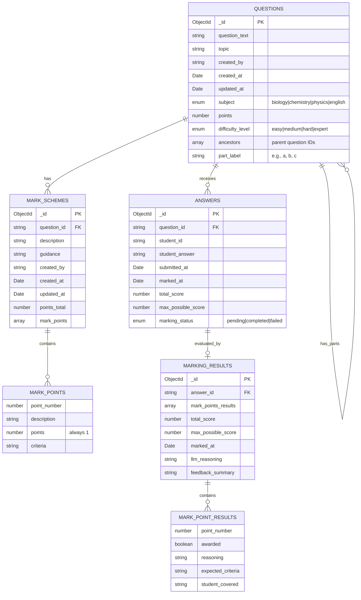

# GCSE AI Examiner - Database Entity Relationship Diagram

## Database Schema Overview

This diagram represents the GCSE AI Examiner database schema with the following entities:

### Core Entities
- **QUESTIONS**: Stores exam questions with metadata like subject, topic, difficulty, and points
- **MARK_SCHEMES**: Contains marking criteria for each question with description and LLM instructions, linked to questions via question_id
- **ANSWERS**: Student submissions linked to questions via question_id
- **MARKING_RESULTS**: AI-generated marking results linked to answers via answer_id

### Embedded Sub-documents
- **MARK_POINTS**: Embedded in MARK_SCHEMES, defines individual marking criteria
- **MARK_POINT_RESULTS**: Embedded in MARKING_RESULTS, contains AI evaluation of each mark point

### Key Relationships
- Questions can have multiple sub-questions/parts (self-referencing one-to-many)
- Questions can have multiple mark schemes (one-to-many)
- Questions can receive multiple answers (one-to-many)
- Answers can have one marking result (one-to-one)
- Mark schemes contain multiple mark points (one-to-many)
- Marking results contain multiple mark point results (one-to-many)

### Data Flow
1. Questions are created with subject, topic, and difficulty (ancestors: [] for main questions)
2. Sub-questions/parts are created with ancestors array pointing to parent questions
3. Mark schemes are created for questions with detailed marking criteria
4. Students submit answers to questions (can be for main questions or sub-questions)
5. AI system evaluates answers against mark schemes
6. Marking results are generated with detailed feedback

### Hierarchical Structure Examples
- **Main Question**: ancestors: [], part_label: undefined
- **Question 1, Part A**: ancestors: ["question_id_1"], part_label: "a"
- **Question 1, Part A.1**: ancestors: ["question_id_1", "question_id_1a"], part_label: "1" 
